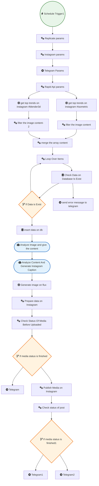

```mermaid
graph TD
    classDef trigger fill:#e8f5e9,stroke:#2e7d32,stroke-width:2px;
    classDef ai fill:#e3f2fd,stroke:#1565c0,stroke-width:2px;
    classDef logic fill:#fff3e0,stroke:#ef6c00,stroke-width:2px;

    If_media_status_is_finished{"fas:fa-code-branch If media status is finished"}:::logic
    If_media_status_is_finished1{"fas:fa-code-branch If media status is finished1"}:::logic
    Telegram["fab:fa-telegram Telegram"]
    Telegram1["fab:fa-telegram Telegram1"]
    Telegram2["fab:fa-telegram Telegram2"]
    Loop_Over_Items["fas:fa-cogs Loop Over Items"]
    Schedule_Trigger1(("fas:fa-bolt Schedule Trigger1")):::trigger
    Telegram_Params["fab:fa-telegram Telegram Params"]
    Instagram_params["fas:fa-cogs Instagram params"]
    Rapid_Api_params["fas:fa-cogs Rapid Api params"]
    filter_the_image_content["fas:fa-cogs filter the image content"]
    get_top_trends_on_instagram__blender3d["fas:fa-globe get top trends on instagram #blender3d"]
    get_top_trends_on_instagram__isometric["fas:fa-globe get top trends on instagram #isometric"]
    merge_the_array_content["fas:fa-cogs merge the array content"]
    Check_Data_on_Database_Is_Exist["fas:fa-database Check Data on Database Is Exist"]
    If_Data_is_Exist{"fas:fa-code-branch If Data is Exist"}:::logic
    send_error_message_to_telegram["fab:fa-telegram send error message to telegram"]
    insert_data_on_db["fas:fa-database insert data on db"]
    Analyze_Image_and_give_the_content(["fas:fa-robot Analyze Image and give the content"]):::ai
    Analyze_Content_And_Generate_Instagram_Caption(["fas:fa-robot Analyze Content And Generate Instagram Caption"]):::ai
    Prepare_data_on_Instagram["fas:fa-cogs Prepare data on Instagram"]
    Check_Status_Of_Media_Before_Uploaded["fas:fa-cogs Check Status Of Media Before Uploaded"]
    Publish_Media_on_Instagram["fas:fa-cogs Publish Media on Instagram"]
    Check_status_of_post_["fas:fa-cogs Check status of post "]
    filter_the_image_content_2["fas:fa-cogs filter the image content-2"]
    Replicate_params["fas:fa-cogs Replicate params"]
    Generate_image_on_flux["fas:fa-globe Generate image on flux"]

    Loop_Over_Items --> Check_Data_on_Database_Is_Exist
    Telegram_Params --> Rapid_Api_params
    If_Data_is_Exist --> Loop_Over_Items
    If_Data_is_Exist --> insert_data_on_db
    Instagram_params --> Telegram_Params
    Rapid_Api_params --> get_top_trends_on_instagram__isometric
    Rapid_Api_params --> get_top_trends_on_instagram__blender3d
    Replicate_params --> Instagram_params
    Schedule_Trigger1 --> Replicate_params
    insert_data_on_db --> Analyze_Image_and_give_the_content
    Check_status_of_post_ --> If_media_status_is_finished1
    Generate_image_on_flux --> Prepare_data_on_Instagram
    merge_the_array_content --> Loop_Over_Items
    filter_the_image_content --> merge_the_array_content
    Prepare_data_on_Instagram --> Check_Status_Of_Media_Before_Uploaded
    Publish_Media_on_Instagram --> Check_status_of_post_
    filter_the_image_content_2 --> merge_the_array_content
    If_media_status_is_finished --> Publish_Media_on_Instagram
    If_media_status_is_finished --> Telegram
    If_media_status_is_finished1 --> Telegram1
    If_media_status_is_finished1 --> Telegram2
    Check_Data_on_Database_Is_Exist --> If_Data_is_Exist
    Check_Data_on_Database_Is_Exist --> send_error_message_to_telegram
    Analyze_Image_and_give_the_content --> Analyze_Content_And_Generate_Instagram_Caption
    Check_Status_Of_Media_Before_Uploaded --> If_media_status_is_finished
    get_top_trends_on_instagram__isometric --> filter_the_image_content
    get_top_trends_on_instagram__blender3d --> filter_the_image_content_2
    Analyze_Content_And_Generate_Instagram_Caption --> Generate_image_on_flux
```
