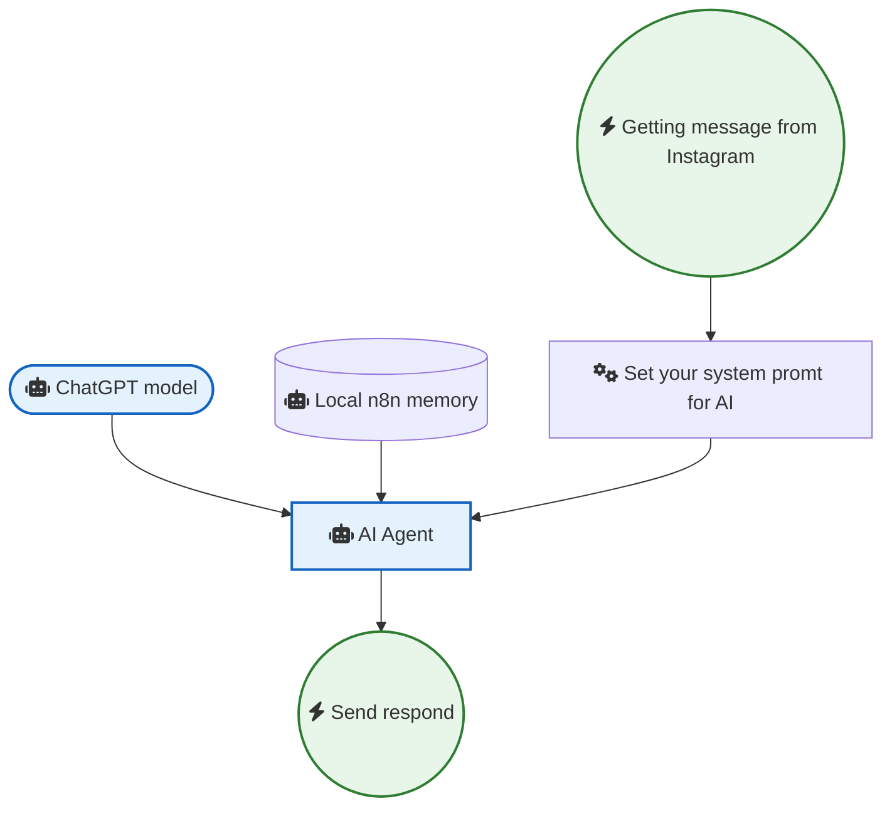

```mermaid
graph TD
    classDef trigger fill:#e8f5e9,stroke:#2e7d32,stroke-width:2px;
    classDef ai fill:#e3f2fd,stroke:#1565c0,stroke-width:2px;
    classDef logic fill:#fff3e0,stroke:#ef6c00,stroke-width:2px;

    Set_your_system_promt_for_AI["fas:fa-cogs Set your system promt for AI"]
    Local_n8n_memory[("fas:fa-robot Local n8n memory")]
    ChatGPT_model(["fas:fa-robot ChatGPT model"]):::ai
    Send_respond_(("fas:fa-bolt Send respond ")):::trigger
    Getting_message_from_Instagram(("fas:fa-bolt Getting message from Instagram")):::trigger
    AI_Agent["fas:fa-robot AI Agent"]:::ai

    AI_Agent --> Send_respond_
    ChatGPT_model --> AI_Agent
    Local_n8n_memory --> AI_Agent
    Set_your_system_promt_for_AI --> AI_Agent
    Getting_message_from_Instagram --> Set_your_system_promt_for_AI
```
