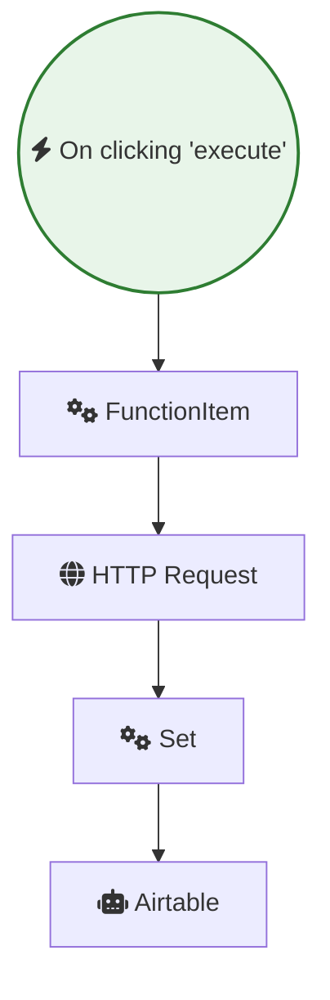

```mermaid
graph TD
    classDef trigger fill:#e8f5e9,stroke:#2e7d32,stroke-width:2px;
    classDef ai fill:#e3f2fd,stroke:#1565c0,stroke-width:2px;
    classDef logic fill:#fff3e0,stroke:#ef6c00,stroke-width:2px;

    On_clicking__execute_(("fas:fa-bolt On clicking 'execute'")):::trigger
    FunctionItem["fas:fa-cogs FunctionItem"]
    HTTP_Request["fas:fa-globe HTTP Request"]
    Airtable["fas:fa-robot Airtable"]
    Set["fas:fa-cogs Set"]

    Set --> Airtable
    FunctionItem --> HTTP_Request
    HTTP_Request --> Set
    On_clicking__execute_ --> FunctionItem
```
