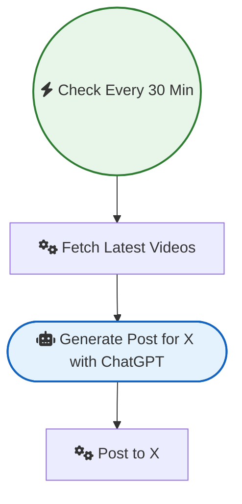

```mermaid
graph TD
    classDef trigger fill:#e8f5e9,stroke:#2e7d32,stroke-width:2px;
    classDef ai fill:#e3f2fd,stroke:#1565c0,stroke-width:2px;
    classDef logic fill:#fff3e0,stroke:#ef6c00,stroke-width:2px;

    Post_to_X["fas:fa-cogs Post to X"]
    Generate_Post_for_X_with_ChatGPT(["fas:fa-robot Generate Post for X with ChatGPT"]):::ai
    Fetch_Latest_Videos["fas:fa-cogs Fetch Latest Videos"]
    Check_Every_30_Min(("fas:fa-bolt Check Every 30 Min")):::trigger

    Check_Every_30_Min --> Fetch_Latest_Videos
    Fetch_Latest_Videos --> Generate_Post_for_X_with_ChatGPT
    Generate_Post_for_X_with_ChatGPT --> Post_to_X
```
