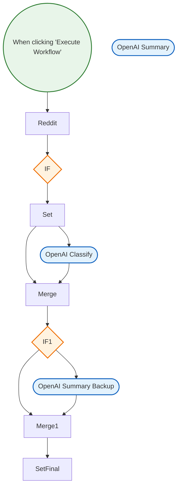

```mermaid
graph TD
    classDef trigger fill:#e8f5e9,stroke:#2e7d32,stroke-width:2px;
    classDef ai fill:#e3f2fd,stroke:#1565c0,stroke-width:2px;
    classDef logic fill:#fff3e0,stroke:#ef6c00,stroke-width:2px;

    When_clicking__Execute_Workflow_(("When clicking 'Execute Workflow'")):::trigger
    Reddit["Reddit"]
    Set["Set"]
    IF{"IF"}:::logic
    IF1{"IF1"}:::logic
    Merge["Merge"]
    Merge1["Merge1"]
    SetFinal["SetFinal"]
    OpenAI_Summary(["OpenAI Summary"]):::ai
    OpenAI_Classify(["OpenAI Classify"]):::ai
    OpenAI_Summary_Backup(["OpenAI Summary Backup"]):::ai

    IF --> Set
    IF1 --> OpenAI_Summary_Backup
    IF1 --> Merge1
    Set --> OpenAI_Classify
    Set --> Merge
    Merge --> IF1
    Merge1 --> SetFinal
    Reddit --> IF
    OpenAI_Classify --> Merge
    OpenAI_Summary_Backup --> Merge1
    When_clicking__Execute_Workflow_ --> Reddit
```
