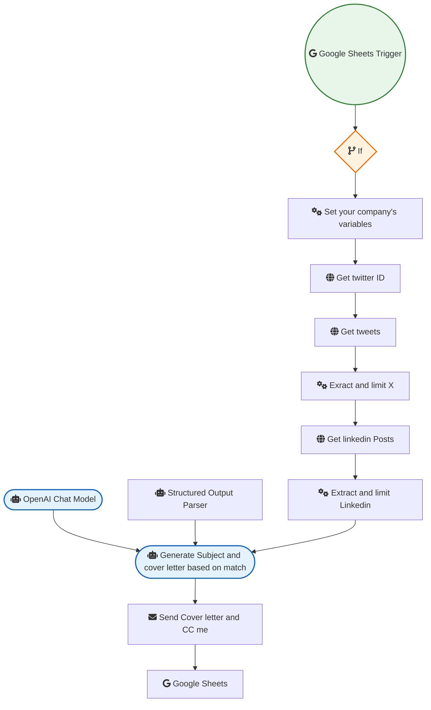

```mermaid
graph TD
    classDef trigger fill:#e8f5e9,stroke:#2e7d32,stroke-width:2px;
    classDef ai fill:#e3f2fd,stroke:#1565c0,stroke-width:2px;
    classDef logic fill:#fff3e0,stroke:#ef6c00,stroke-width:2px;

    Set_your_company_s_variables["fas:fa-cogs Set your company's variables"]
    Get_linkedin_Posts["fas:fa-globe Get linkedin Posts"]
    Get_twitter_ID["fas:fa-globe Get twitter ID"]
    Get_tweets["fas:fa-globe Get tweets"]
    Extract_and_limit_Linkedin["fas:fa-cogs Extract and limit Linkedin"]
    Exract_and_limit_X["fas:fa-cogs Exract and limit X"]
    OpenAI_Chat_Model(["fas:fa-robot OpenAI Chat Model"]):::ai
    Structured_Output_Parser["fas:fa-robot Structured Output Parser"]
    Generate_Subject_and_cover_letter_based_on_match(["fas:fa-robot Generate Subject and cover letter based on match"]):::ai
    Send_Cover_letter_and_CC_me["fas:fa-envelope Send Cover letter and CC me"]
    Google_Sheets_Trigger(("fab:fa-google Google Sheets Trigger")):::trigger
    Google_Sheets["fab:fa-google Google Sheets"]
    If{"fas:fa-code-branch If"}:::logic

    If --> Set_your_company_s_variables
    Get_tweets --> Exract_and_limit_X
    Get_twitter_ID --> Get_tweets
    OpenAI_Chat_Model --> Generate_Subject_and_cover_letter_based_on_match
    Exract_and_limit_X --> Get_linkedin_Posts
    Get_linkedin_Posts --> Extract_and_limit_Linkedin
    Google_Sheets_Trigger --> If
    Structured_Output_Parser --> Generate_Subject_and_cover_letter_based_on_match
    Extract_and_limit_Linkedin --> Generate_Subject_and_cover_letter_based_on_match
    Send_Cover_letter_and_CC_me --> Google_Sheets
    Set_your_company_s_variables --> Get_twitter_ID
    Generate_Subject_and_cover_letter_based_on_match --> Send_Cover_letter_and_CC_me
```
