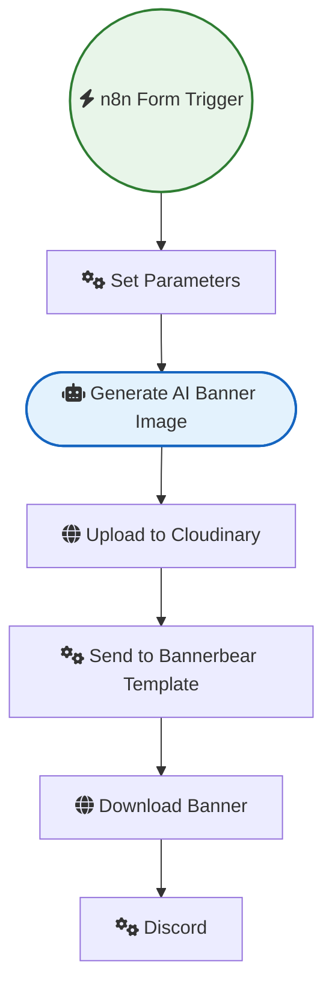

```mermaid
graph TD
    classDef trigger fill:#e8f5e9,stroke:#2e7d32,stroke-width:2px;
    classDef ai fill:#e3f2fd,stroke:#1565c0,stroke-width:2px;
    classDef logic fill:#fff3e0,stroke:#ef6c00,stroke-width:2px;

    n8n_Form_Trigger(("fas:fa-bolt n8n Form Trigger")):::trigger
    Upload_to_Cloudinary["fas:fa-globe Upload to Cloudinary"]
    Send_to_Bannerbear_Template["fas:fa-cogs Send to Bannerbear Template"]
    Set_Parameters["fas:fa-cogs Set Parameters"]
    Download_Banner["fas:fa-globe Download Banner"]
    Discord["fas:fa-cogs Discord"]
    Generate_AI_Banner_Image(["fas:fa-robot Generate AI Banner Image"]):::ai

    Set_Parameters --> Generate_AI_Banner_Image
    Download_Banner --> Discord
    n8n_Form_Trigger --> Set_Parameters
    Upload_to_Cloudinary --> Send_to_Bannerbear_Template
    Generate_AI_Banner_Image --> Upload_to_Cloudinary
    Send_to_Bannerbear_Template --> Download_Banner
```
