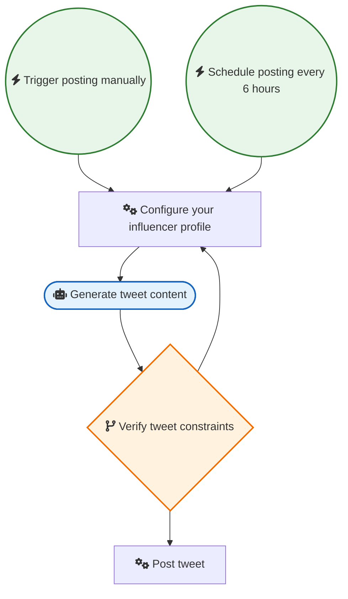

```mermaid
graph TD
    classDef trigger fill:#e8f5e9,stroke:#2e7d32,stroke-width:2px;
    classDef ai fill:#e3f2fd,stroke:#1565c0,stroke-width:2px;
    classDef logic fill:#fff3e0,stroke:#ef6c00,stroke-width:2px;

    Post_tweet["fas:fa-cogs Post tweet"]
    Schedule_posting_every_6_hours(("fas:fa-bolt Schedule posting every 6 hours")):::trigger
    Trigger_posting_manually(("fas:fa-bolt Trigger posting manually")):::trigger
    Verify_tweet_constraints{"fas:fa-code-branch Verify tweet constraints"}:::logic
    Generate_tweet_content(["fas:fa-robot Generate tweet content"]):::ai
    Configure_your_influencer_profile["fas:fa-cogs Configure your influencer profile"]

    Generate_tweet_content --> Verify_tweet_constraints
    Trigger_posting_manually --> Configure_your_influencer_profile
    Verify_tweet_constraints --> Configure_your_influencer_profile
    Verify_tweet_constraints --> Post_tweet
    Schedule_posting_every_6_hours --> Configure_your_influencer_profile
    Configure_your_influencer_profile --> Generate_tweet_content
```
