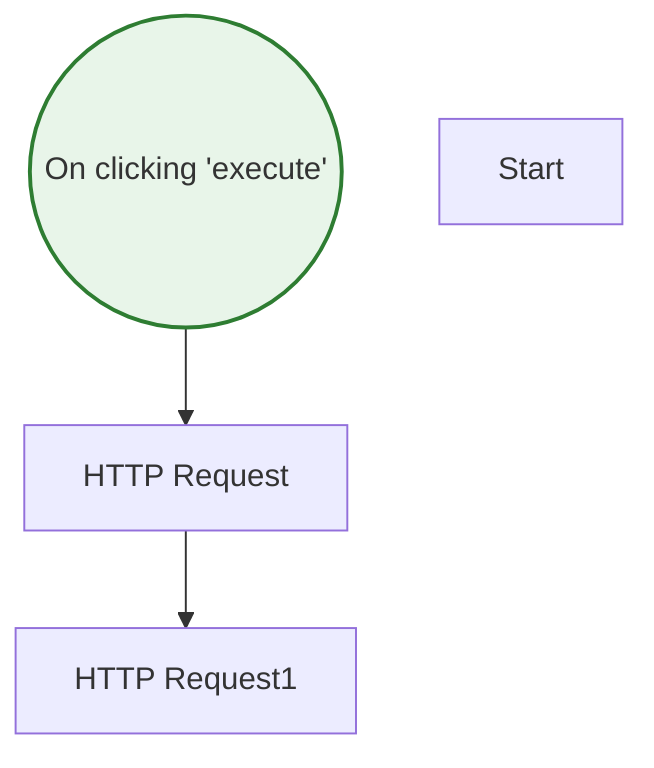

```mermaid
graph TD
    classDef trigger fill:#e8f5e9,stroke:#2e7d32,stroke-width:2px;
    classDef ai fill:#e3f2fd,stroke:#1565c0,stroke-width:2px;
    classDef logic fill:#fff3e0,stroke:#ef6c00,stroke-width:2px;

    On_clicking__execute_(("On clicking 'execute'")):::trigger
    Start["Start"]
    HTTP_Request["HTTP Request"]
    HTTP_Request1["HTTP Request1"]

    HTTP_Request --> HTTP_Request1
    On_clicking__execute_ --> HTTP_Request
```
