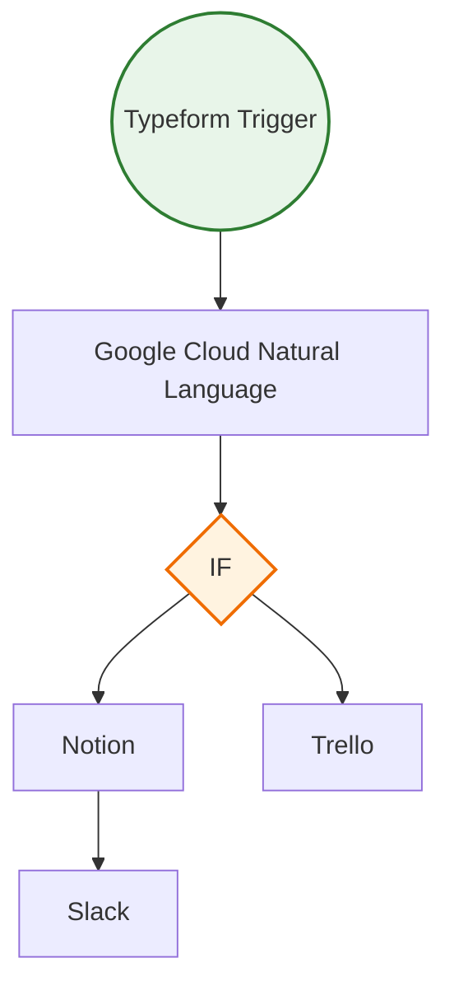

```mermaid
graph TD
    classDef trigger fill:#e8f5e9,stroke:#2e7d32,stroke-width:2px;
    classDef ai fill:#e3f2fd,stroke:#1565c0,stroke-width:2px;
    classDef logic fill:#fff3e0,stroke:#ef6c00,stroke-width:2px;

    Typeform_Trigger(("Typeform Trigger")):::trigger
    Google_Cloud_Natural_Language["Google Cloud Natural Language"]
    IF{"IF"}:::logic
    Notion["Notion"]
    Slack["Slack"]
    Trello["Trello"]

    IF --> Notion
    IF --> Trello
    Notion --> Slack
    Typeform_Trigger --> Google_Cloud_Natural_Language
    Google_Cloud_Natural_Language --> IF
```
