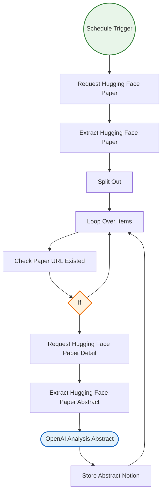

```mermaid
graph TD
    classDef trigger fill:#e8f5e9,stroke:#2e7d32,stroke-width:2px;
    classDef ai fill:#e3f2fd,stroke:#1565c0,stroke-width:2px;
    classDef logic fill:#fff3e0,stroke:#ef6c00,stroke-width:2px;

    Schedule_Trigger(("Schedule Trigger")):::trigger
    If{"If"}:::logic
    Loop_Over_Items["Loop Over Items"]
    Split_Out["Split Out"]
    Request_Hugging_Face_Paper["Request Hugging Face Paper"]
    Extract_Hugging_Face_Paper["Extract Hugging Face Paper"]
    Check_Paper_URL_Existed["Check Paper URL Existed"]
    Request_Hugging_Face_Paper_Detail["Request Hugging Face Paper Detail"]
    OpenAI_Analysis_Abstract(["OpenAI Analysis Abstract"]):::ai
    Store_Abstract_Notion["Store Abstract Notion"]
    Extract_Hugging_Face_Paper_Abstract["Extract Hugging Face Paper Abstract"]

    If --> Request_Hugging_Face_Paper_Detail
    If --> Loop_Over_Items
    Split_Out --> Loop_Over_Items
    Loop_Over_Items --> Check_Paper_URL_Existed
    Schedule_Trigger --> Request_Hugging_Face_Paper
    Store_Abstract_Notion --> Loop_Over_Items
    Check_Paper_URL_Existed --> If
    OpenAI_Analysis_Abstract --> Store_Abstract_Notion
    Extract_Hugging_Face_Paper --> Split_Out
    Request_Hugging_Face_Paper --> Extract_Hugging_Face_Paper
    Request_Hugging_Face_Paper_Detail --> Extract_Hugging_Face_Paper_Abstract
    Extract_Hugging_Face_Paper_Abstract --> OpenAI_Analysis_Abstract
```
