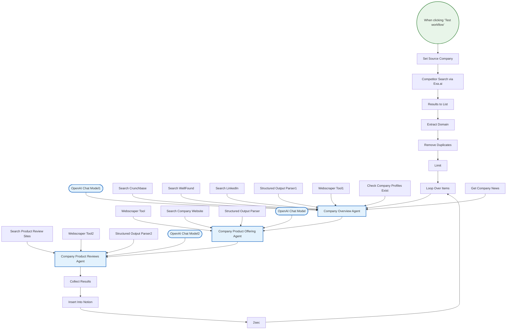

```mermaid
graph TD
    classDef trigger fill:#e8f5e9,stroke:#2e7d32,stroke-width:2px;
    classDef ai fill:#e3f2fd,stroke:#1565c0,stroke-width:2px;
    classDef logic fill:#fff3e0,stroke:#ef6c00,stroke-width:2px;

    When_clicking__Test_workflow_(("When clicking ‘Test workflow’")):::trigger
    OpenAI_Chat_Model1(["OpenAI Chat Model1"]):::ai
    Search_Crunchbase["Search Crunchbase"]
    Search_WellFound["Search WellFound"]
    Search_LinkedIn["Search LinkedIn"]
    Structured_Output_Parser1["Structured Output Parser1"]
    Webscraper_Tool1["Webscraper Tool1"]
    Remove_Duplicates["Remove Duplicates"]
    Extract_Domain["Extract Domain"]
    Results_to_List["Results to List"]
    Check_Company_Profiles_Exist["Check Company Profiles Exist"]
    Webscraper_Tool["Webscraper Tool"]
    Search_Company_Website["Search Company Website"]
    Structured_Output_Parser["Structured Output Parser"]
    OpenAI_Chat_Model(["OpenAI Chat Model"]):::ai
    Search_Product_Review_Sites["Search Product Review Sites"]
    Webscraper_Tool2["Webscraper Tool2"]
    Structured_Output_Parser2["Structured Output Parser2"]
    OpenAI_Chat_Model2(["OpenAI Chat Model2"]):::ai
    Insert_Into_Notion["Insert Into Notion"]
    Limit["Limit"]
    Loop_Over_Items["Loop Over Items"]
    Competitor_Search_via_Exa_ai["Competitor Search via Exa.ai"]
    Get_Company_News["Get Company News"]
    Set_Source_Company["Set Source Company"]
    Collect_Results["Collect Results"]
    n_2sec["2sec"]
    Company_Overview_Agent["Company Overview Agent"]:::ai
    Company_Product_Offering_Agent["Company Product Offering Agent"]:::ai
    Company_Product_Reviews_Agent["Company Product Reviews Agent"]:::ai

    n_2sec --> Loop_Over_Items
    Limit --> Loop_Over_Items
    Extract_Domain --> Remove_Duplicates
    Collect_Results --> Insert_Into_Notion
    Loop_Over_Items --> Company_Overview_Agent
    Results_to_List --> Extract_Domain
    Search_LinkedIn --> Company_Overview_Agent
    Webscraper_Tool --> Company_Product_Offering_Agent
    Get_Company_News --> Company_Overview_Agent
    Search_WellFound --> Company_Overview_Agent
    Webscraper_Tool1 --> Company_Overview_Agent
    Webscraper_Tool2 --> Company_Product_Reviews_Agent
    OpenAI_Chat_Model --> Company_Product_Offering_Agent
    Remove_Duplicates --> Limit
    Search_Crunchbase --> Company_Overview_Agent
    Insert_Into_Notion --> n_2sec
    OpenAI_Chat_Model1 --> Company_Overview_Agent
    OpenAI_Chat_Model2 --> Company_Product_Reviews_Agent
    Set_Source_Company --> Competitor_Search_via_Exa_ai
    Company_Overview_Agent --> Company_Product_Offering_Agent
    Search_Company_Website --> Company_Product_Offering_Agent
    Structured_Output_Parser --> Company_Product_Offering_Agent
    Structured_Output_Parser1 --> Company_Overview_Agent
    Structured_Output_Parser2 --> Company_Product_Reviews_Agent
    Search_Product_Review_Sites --> Company_Product_Reviews_Agent
    Check_Company_Profiles_Exist --> Company_Overview_Agent
    Competitor_Search_via_Exa_ai --> Results_to_List
    Company_Product_Reviews_Agent --> Collect_Results
    Company_Product_Offering_Agent --> Company_Product_Reviews_Agent
    When_clicking__Test_workflow_ --> Set_Source_Company
```
