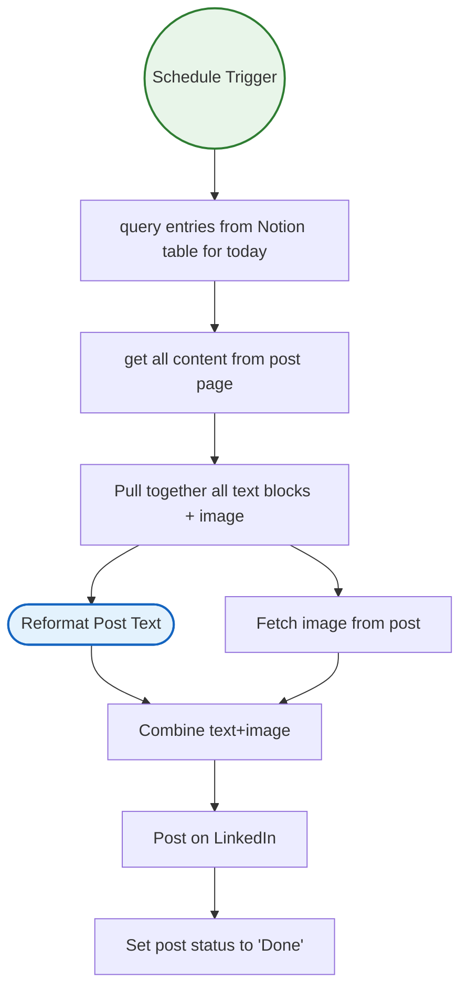

```mermaid
graph TD
    classDef trigger fill:#e8f5e9,stroke:#2e7d32,stroke-width:2px;
    classDef ai fill:#e3f2fd,stroke:#1565c0,stroke-width:2px;
    classDef logic fill:#fff3e0,stroke:#ef6c00,stroke-width:2px;

    Schedule_Trigger(("Schedule Trigger")):::trigger
    Set_post_status_to__Done_["Set post status to 'Done'"]
    Post_on_LinkedIn["Post on LinkedIn"]
    Combine_text_image["Combine text+image"]
    Fetch_image_from_post["Fetch image from post"]
    Reformat_Post_Text(["Reformat Post Text"]):::ai
    get_all_content_from_post_page["get all content from post page"]
    Pull_together_all_text_blocks___image["Pull together all text blocks + image"]
    query_entries_from_Notion_table_for_today["query entries from Notion table for today"]

    Post_on_LinkedIn --> Set_post_status_to__Done_
    Schedule_Trigger --> query_entries_from_Notion_table_for_today
    Combine_text_image --> Post_on_LinkedIn
    Reformat_Post_Text --> Combine_text_image
    Fetch_image_from_post --> Combine_text_image
    get_all_content_from_post_page --> Pull_together_all_text_blocks___image
    Pull_together_all_text_blocks___image --> Fetch_image_from_post
    Pull_together_all_text_blocks___image --> Reformat_Post_Text
    query_entries_from_Notion_table_for_today --> get_all_content_from_post_page
```
