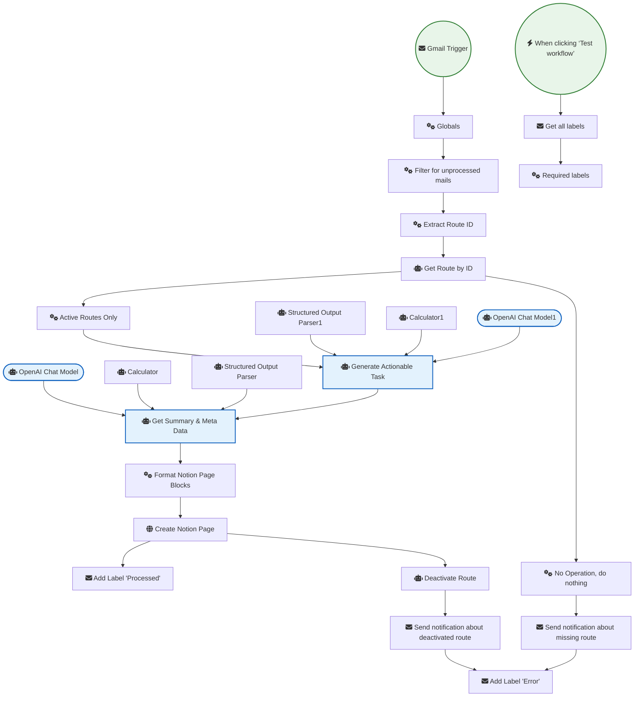

```mermaid
graph TD
    classDef trigger fill:#e8f5e9,stroke:#2e7d32,stroke-width:2px;
    classDef ai fill:#e3f2fd,stroke:#1565c0,stroke-width:2px;
    classDef logic fill:#fff3e0,stroke:#ef6c00,stroke-width:2px;

    OpenAI_Chat_Model(["fas:fa-robot OpenAI Chat Model"]):::ai
    Calculator["fas:fa-robot Calculator"]
    Structured_Output_Parser["fas:fa-robot Structured Output Parser"]
    Add_Label__Processed_["fas:fa-envelope Add Label 'Processed'"]
    Active_Routes_Only["fas:fa-cogs Active Routes Only"]
    Extract_Route_ID["fas:fa-cogs Extract Route ID"]
    Deactivate_Route["fas:fa-robot Deactivate Route"]
    Add_Label__Error_["fas:fa-envelope Add Label 'Error'"]
    Send_notification_about_deactivated_route["fas:fa-envelope Send notification about deactivated route"]
    Send_notification_about_missing_route["fas:fa-envelope Send notification about missing route"]
    Get_Route_by_ID["fas:fa-robot Get Route by ID"]
    Create_Notion_Page["fas:fa-globe Create Notion Page"]
    Gmail_Trigger(("fas:fa-envelope Gmail Trigger")):::trigger
    Filter_for_unprocessed_mails["fas:fa-cogs Filter for unprocessed mails"]
    When_clicking__Test_workflow_(("fas:fa-bolt When clicking ‘Test workflow’")):::trigger
    Required_labels["fas:fa-cogs Required labels"]
    Globals["fas:fa-cogs Globals"]
    No_Operation__do_nothing["fas:fa-cogs No Operation, do nothing"]
    Format_Notion_Page_Blocks["fas:fa-cogs Format Notion Page Blocks"]
    Get_all_labels["fas:fa-envelope Get all labels"]
    Structured_Output_Parser1["fas:fa-robot Structured Output Parser1"]
    Calculator1["fas:fa-robot Calculator1"]
    OpenAI_Chat_Model1(["fas:fa-robot OpenAI Chat Model1"]):::ai
    Generate_Actionable_Task["fas:fa-robot Generate Actionable Task"]:::ai
    Get_Summary___Meta_Data["fas:fa-robot Get Summary & Meta Data"]:::ai

    Globals --> Filter_for_unprocessed_mails
    Calculator --> Get_Summary___Meta_Data
    Calculator1 --> Generate_Actionable_Task
    Gmail_Trigger --> Globals
    Get_all_labels --> Required_labels
    Get_Route_by_ID --> Active_Routes_Only
    Get_Route_by_ID --> No_Operation__do_nothing
    Deactivate_Route --> Send_notification_about_deactivated_route
    Extract_Route_ID --> Get_Route_by_ID
    OpenAI_Chat_Model --> Get_Summary___Meta_Data
    Active_Routes_Only --> Generate_Actionable_Task
    Create_Notion_Page --> Add_Label__Processed_
    Create_Notion_Page --> Deactivate_Route
    OpenAI_Chat_Model1 --> Generate_Actionable_Task
    Get_Summary___Meta_Data --> Format_Notion_Page_Blocks
    Generate_Actionable_Task --> Get_Summary___Meta_Data
    No_Operation__do_nothing --> Send_notification_about_missing_route
    Structured_Output_Parser --> Get_Summary___Meta_Data
    Format_Notion_Page_Blocks --> Create_Notion_Page
    Structured_Output_Parser1 --> Generate_Actionable_Task
    Filter_for_unprocessed_mails --> Extract_Route_ID
    When_clicking__Test_workflow_ --> Get_all_labels
    Send_notification_about_missing_route --> Add_Label__Error_
    Send_notification_about_deactivated_route --> Add_Label__Error_
```
