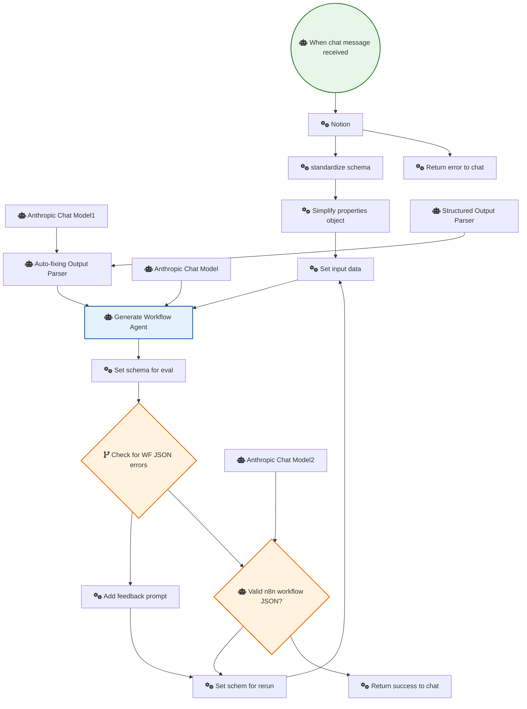

```mermaid
graph TD
    classDef trigger fill:#e8f5e9,stroke:#2e7d32,stroke-width:2px;
    classDef ai fill:#e3f2fd,stroke:#1565c0,stroke-width:2px;
    classDef logic fill:#fff3e0,stroke:#ef6c00,stroke-width:2px;

    Notion["fas:fa-cogs Notion"]
    Return_success_to_chat["fas:fa-cogs Return success to chat"]
    Auto_fixing_Output_Parser["fas:fa-robot Auto-fixing Output Parser"]
    Anthropic_Chat_Model["fas:fa-robot Anthropic Chat Model"]
    Set_schema_for_eval["fas:fa-cogs Set schema for eval"]
    Return_error_to_chat["fas:fa-cogs Return error to chat"]
    Anthropic_Chat_Model1["fas:fa-robot Anthropic Chat Model1"]
    standardize_schema["fas:fa-cogs standardize schema"]
    Simplify_properties_object["fas:fa-cogs Simplify properties object"]
    Structured_Output_Parser["fas:fa-robot Structured Output Parser"]
    Set_input_data["fas:fa-cogs Set input data"]
    Set_schem_for_rerun["fas:fa-cogs Set schem for rerun"]
    Add_feedback_prompt["fas:fa-cogs Add feedback prompt"]
    Check_for_WF_JSON_errors{"fas:fa-code-branch Check for WF JSON errors"}:::logic
    Generate_Workflow_Agent["fas:fa-robot Generate Workflow Agent"]:::ai
    Anthropic_Chat_Model2["fas:fa-robot Anthropic Chat Model2"]
    When_chat_message_received(("fas:fa-robot When chat message received")):::trigger
    Valid_n8n_workflow_JSON_{"fas:fa-robot Valid n8n workflow JSON?"}:::logic

    Notion --> standardize_schema
    Notion --> Return_error_to_chat
    Set_input_data --> Generate_Workflow_Agent
    standardize_schema --> Simplify_properties_object
    Add_feedback_prompt --> Set_schem_for_rerun
    Set_schem_for_rerun --> Set_input_data
    Set_schema_for_eval --> Check_for_WF_JSON_errors
    Anthropic_Chat_Model --> Generate_Workflow_Agent
    Anthropic_Chat_Model1 --> Auto_fixing_Output_Parser
    Anthropic_Chat_Model2 --> Valid_n8n_workflow_JSON_
    Generate_Workflow_Agent --> Set_schema_for_eval
    Check_for_WF_JSON_errors --> Add_feedback_prompt
    Check_for_WF_JSON_errors --> Valid_n8n_workflow_JSON_
    Structured_Output_Parser --> Auto_fixing_Output_Parser
    Valid_n8n_workflow_JSON_ --> Set_schem_for_rerun
    Valid_n8n_workflow_JSON_ --> Return_success_to_chat
    Auto_fixing_Output_Parser --> Generate_Workflow_Agent
    Simplify_properties_object --> Set_input_data
    When_chat_message_received --> Notion
```
