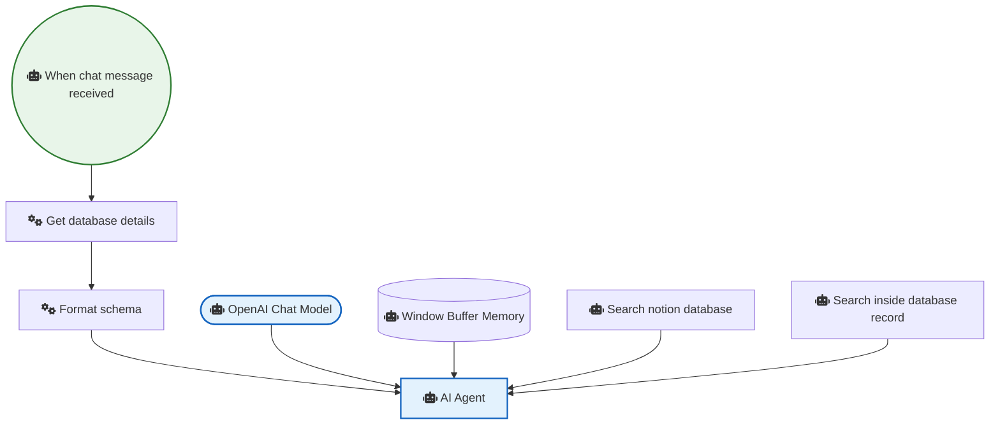

```mermaid
graph TD
    classDef trigger fill:#e8f5e9,stroke:#2e7d32,stroke-width:2px;
    classDef ai fill:#e3f2fd,stroke:#1565c0,stroke-width:2px;
    classDef logic fill:#fff3e0,stroke:#ef6c00,stroke-width:2px;

    OpenAI_Chat_Model(["fas:fa-robot OpenAI Chat Model"]):::ai
    Search_notion_database["fas:fa-robot Search notion database"]
    Get_database_details["fas:fa-cogs Get database details"]
    Window_Buffer_Memory[("fas:fa-robot Window Buffer Memory")]
    Search_inside_database_record["fas:fa-robot Search inside database record"]
    Format_schema["fas:fa-cogs Format schema"]
    AI_Agent["fas:fa-robot AI Agent"]:::ai
    When_chat_message_received(("fas:fa-robot When chat message received")):::trigger

    Format_schema --> AI_Agent
    OpenAI_Chat_Model --> AI_Agent
    Get_database_details --> Format_schema
    Window_Buffer_Memory --> AI_Agent
    Search_notion_database --> AI_Agent
    When_chat_message_received --> Get_database_details
    Search_inside_database_record --> AI_Agent
```
