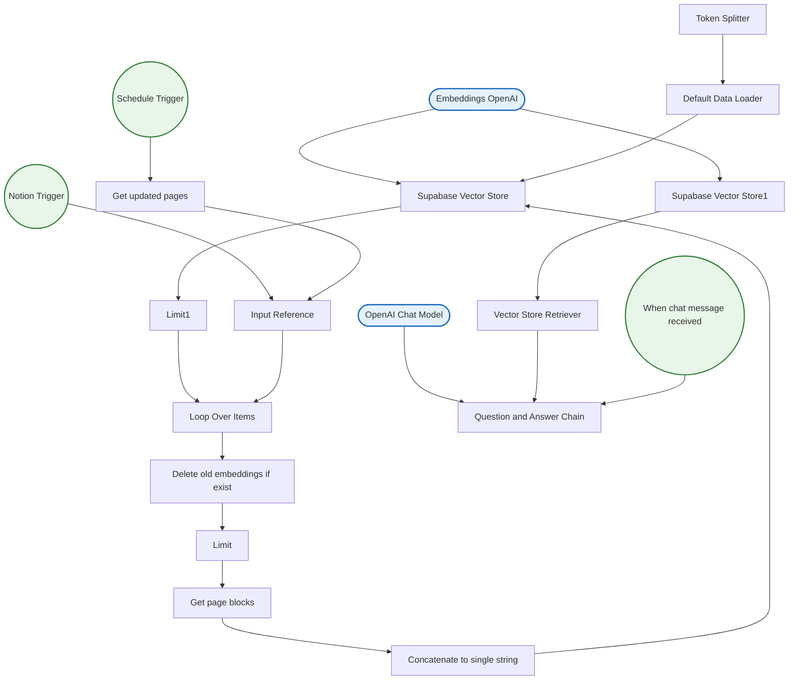

```mermaid
graph TD
    classDef trigger fill:#e8f5e9,stroke:#2e7d32,stroke-width:2px;
    classDef ai fill:#e3f2fd,stroke:#1565c0,stroke-width:2px;
    classDef logic fill:#fff3e0,stroke:#ef6c00,stroke-width:2px;

    Embeddings_OpenAI(["Embeddings OpenAI"]):::ai
    Token_Splitter["Token Splitter"]
    Loop_Over_Items["Loop Over Items"]
    Question_and_Answer_Chain["Question and Answer Chain"]
    Vector_Store_Retriever["Vector Store Retriever"]
    OpenAI_Chat_Model(["OpenAI Chat Model"]):::ai
    When_chat_message_received(("When chat message received")):::trigger
    Schedule_Trigger(("Schedule Trigger")):::trigger
    Limit["Limit"]
    Limit1["Limit1"]
    Delete_old_embeddings_if_exist["Delete old embeddings if exist"]
    Get_page_blocks["Get page blocks"]
    Default_Data_Loader["Default Data Loader"]
    Input_Reference["Input Reference"]
    Notion_Trigger(("Notion Trigger")):::trigger
    Get_updated_pages["Get updated pages"]
    Supabase_Vector_Store1["Supabase Vector Store1"]
    Supabase_Vector_Store["Supabase Vector Store"]
    Concatenate_to_single_string["Concatenate to single string"]

    Limit --> Get_page_blocks
    Limit1 --> Loop_Over_Items
    Notion_Trigger --> Input_Reference
    Token_Splitter --> Default_Data_Loader
    Get_page_blocks --> Concatenate_to_single_string
    Input_Reference --> Loop_Over_Items
    Loop_Over_Items --> Delete_old_embeddings_if_exist
    Schedule_Trigger --> Get_updated_pages
    Embeddings_OpenAI --> Supabase_Vector_Store
    Embeddings_OpenAI --> Supabase_Vector_Store1
    Get_updated_pages --> Input_Reference
    OpenAI_Chat_Model --> Question_and_Answer_Chain
    Default_Data_Loader --> Supabase_Vector_Store
    Supabase_Vector_Store --> Limit1
    Supabase_Vector_Store1 --> Vector_Store_Retriever
    Vector_Store_Retriever --> Question_and_Answer_Chain
    When_chat_message_received --> Question_and_Answer_Chain
    Concatenate_to_single_string --> Supabase_Vector_Store
    Delete_old_embeddings_if_exist --> Limit
```
