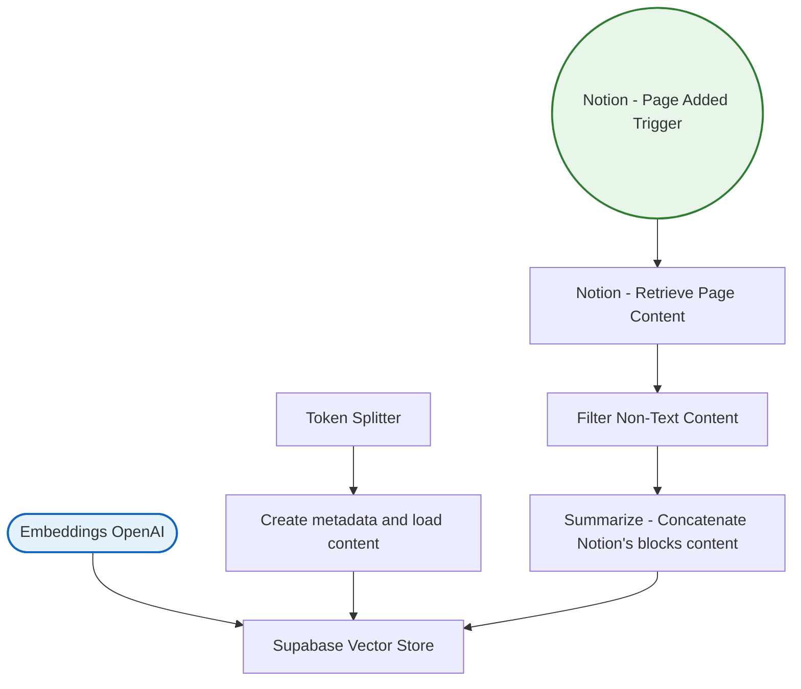

```mermaid
graph TD
    classDef trigger fill:#e8f5e9,stroke:#2e7d32,stroke-width:2px;
    classDef ai fill:#e3f2fd,stroke:#1565c0,stroke-width:2px;
    classDef logic fill:#fff3e0,stroke:#ef6c00,stroke-width:2px;

    Embeddings_OpenAI(["Embeddings OpenAI"]):::ai
    Token_Splitter["Token Splitter"]
    Notion___Page_Added_Trigger(("Notion - Page Added Trigger")):::trigger
    Notion___Retrieve_Page_Content["Notion - Retrieve Page Content"]
    Filter_Non_Text_Content["Filter Non-Text Content"]
    Summarize___Concatenate_Notion_s_blocks_content["Summarize - Concatenate Notion's blocks content"]
    Create_metadata_and_load_content["Create metadata and load content"]
    Supabase_Vector_Store["Supabase Vector Store"]

    Token_Splitter --> Create_metadata_and_load_content
    Embeddings_OpenAI --> Supabase_Vector_Store
    Filter_Non_Text_Content --> Summarize___Concatenate_Notion_s_blocks_content
    Notion___Page_Added_Trigger --> Notion___Retrieve_Page_Content
    Notion___Retrieve_Page_Content --> Filter_Non_Text_Content
    Create_metadata_and_load_content --> Supabase_Vector_Store
    Summarize___Concatenate_Notion_s_blocks_content --> Supabase_Vector_Store
```
