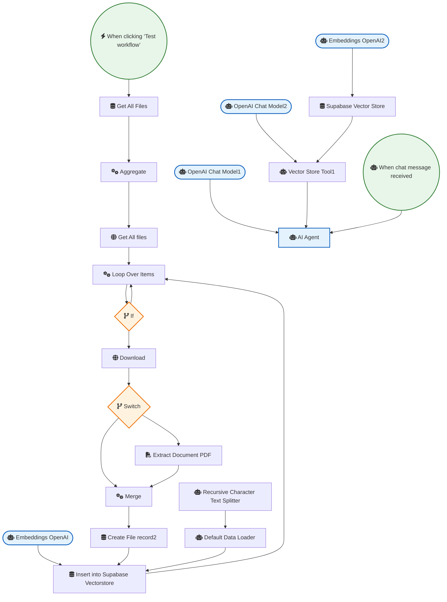

```mermaid
graph TD
    classDef trigger fill:#e8f5e9,stroke:#2e7d32,stroke-width:2px;
    classDef ai fill:#e3f2fd,stroke:#1565c0,stroke-width:2px;
    classDef logic fill:#fff3e0,stroke:#ef6c00,stroke-width:2px;

    Get_All_files["fas:fa-globe Get All files"]
    Default_Data_Loader["fas:fa-robot Default Data Loader"]
    Recursive_Character_Text_Splitter["fas:fa-robot Recursive Character Text Splitter"]
    Extract_Document_PDF["fas:fa-file-pdf Extract Document PDF"]
    Embeddings_OpenAI(["fas:fa-robot Embeddings OpenAI"]):::ai
    Create_File_record2["fas:fa-database Create File record2"]
    If{"fas:fa-code-branch If"}:::logic
    Get_All_Files["fas:fa-database Get All Files"]
    Download["fas:fa-globe Download"]
    Loop_Over_Items["fas:fa-cogs Loop Over Items"]
    When_clicking__Test_workflow_(("fas:fa-bolt When clicking ‘Test workflow’")):::trigger
    Aggregate["fas:fa-cogs Aggregate"]
    When_chat_message_received(("fas:fa-robot When chat message received")):::trigger
    OpenAI_Chat_Model1(["fas:fa-robot OpenAI Chat Model1"]):::ai
    Embeddings_OpenAI2(["fas:fa-robot Embeddings OpenAI2"]):::ai
    OpenAI_Chat_Model2(["fas:fa-robot OpenAI Chat Model2"]):::ai
    Vector_Store_Tool1["fas:fa-robot Vector Store Tool1"]
    Switch{"fas:fa-code-branch Switch"}:::logic
    Insert_into_Supabase_Vectorstore["fas:fa-database Insert into Supabase Vectorstore"]
    Merge["fas:fa-cogs Merge"]
    AI_Agent["fas:fa-robot AI Agent"]:::ai
    Supabase_Vector_Store["fas:fa-database Supabase Vector Store"]

    If --> Download
    If --> Loop_Over_Items
    Merge --> Create_File_record2
    Switch --> Merge
    Switch --> Extract_Document_PDF
    Download --> Switch
    Aggregate --> Get_All_files
    Get_All_Files --> Aggregate
    Get_All_files --> Loop_Over_Items
    Loop_Over_Items --> If
    Embeddings_OpenAI --> Insert_into_Supabase_Vectorstore
    Embeddings_OpenAI2 --> Supabase_Vector_Store
    OpenAI_Chat_Model1 --> AI_Agent
    OpenAI_Chat_Model2 --> Vector_Store_Tool1
    Vector_Store_Tool1 --> AI_Agent
    Create_File_record2 --> Insert_into_Supabase_Vectorstore
    Default_Data_Loader --> Insert_into_Supabase_Vectorstore
    Extract_Document_PDF --> Merge
    Supabase_Vector_Store --> Vector_Store_Tool1
    When_chat_message_received --> AI_Agent
    Insert_into_Supabase_Vectorstore --> Loop_Over_Items
    Recursive_Character_Text_Splitter --> Default_Data_Loader
    When_clicking__Test_workflow_ --> Get_All_Files
```
