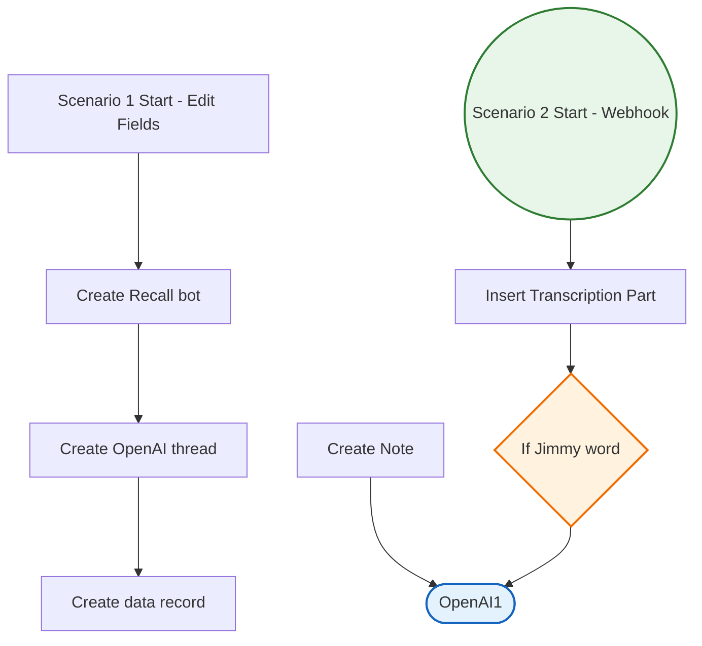

```mermaid
graph TD
    classDef trigger fill:#e8f5e9,stroke:#2e7d32,stroke-width:2px;
    classDef ai fill:#e3f2fd,stroke:#1565c0,stroke-width:2px;
    classDef logic fill:#fff3e0,stroke:#ef6c00,stroke-width:2px;

    OpenAI1(["OpenAI1"]):::ai
    Insert_Transcription_Part["Insert Transcription Part"]
    Create_Note["Create Note"]
    Create_Recall_bot["Create Recall bot"]
    Create_OpenAI_thread["Create OpenAI thread"]
    Create_data_record["Create data record"]
    Scenario_1_Start___Edit_Fields["Scenario 1 Start - Edit Fields"]
    Scenario_2_Start___Webhook(("Scenario 2 Start - Webhook")):::trigger
    If_Jimmy_word{"If Jimmy word"}:::logic

    Create_Note --> OpenAI1
    If_Jimmy_word --> OpenAI1
    Create_Recall_bot --> Create_OpenAI_thread
    Create_OpenAI_thread --> Create_data_record
    Insert_Transcription_Part --> If_Jimmy_word
    Scenario_2_Start___Webhook --> Insert_Transcription_Part
    Scenario_1_Start___Edit_Fields --> Create_Recall_bot
```
