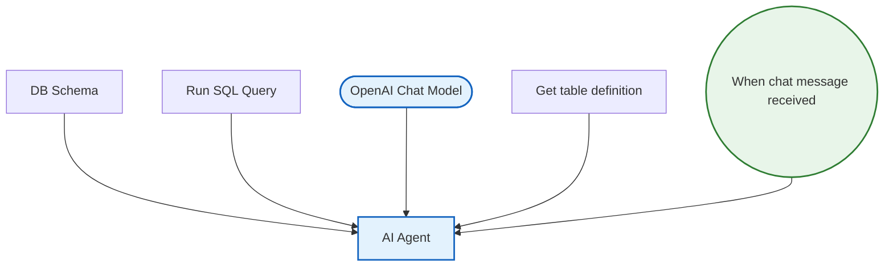

```mermaid
graph TD
    classDef trigger fill:#e8f5e9,stroke:#2e7d32,stroke-width:2px;
    classDef ai fill:#e3f2fd,stroke:#1565c0,stroke-width:2px;
    classDef logic fill:#fff3e0,stroke:#ef6c00,stroke-width:2px;

    When_chat_message_received(("When chat message received")):::trigger
    OpenAI_Chat_Model(["OpenAI Chat Model"]):::ai
    DB_Schema["DB Schema"]
    Get_table_definition["Get table definition"]
    AI_Agent["AI Agent"]:::ai
    Run_SQL_Query["Run SQL Query"]

    DB_Schema --> AI_Agent
    Run_SQL_Query --> AI_Agent
    OpenAI_Chat_Model --> AI_Agent
    Get_table_definition --> AI_Agent
    When_chat_message_received --> AI_Agent
```
