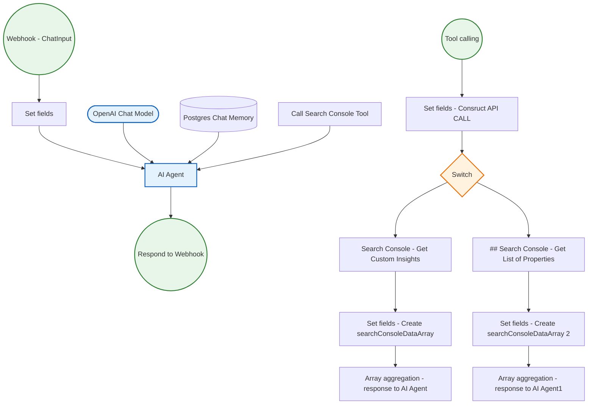

```mermaid
graph TD
    classDef trigger fill:#e8f5e9,stroke:#2e7d32,stroke-width:2px;
    classDef ai fill:#e3f2fd,stroke:#1565c0,stroke-width:2px;
    classDef logic fill:#fff3e0,stroke:#ef6c00,stroke-width:2px;

    Postgres_Chat_Memory[("Postgres Chat Memory")]
    OpenAI_Chat_Model(["OpenAI Chat Model"]):::ai
    Set_fields["Set fields"]
    Webhook___ChatInput(("Webhook - ChatInput")):::trigger
    Respond_to_Webhook(("Respond to Webhook")):::trigger
    Call_Search_Console_Tool["Call Search Console Tool"]
    Tool_calling(("Tool calling")):::trigger
    Switch{"Switch"}:::logic
    Set_fields___Consruct_API_CALL["Set fields - Consruct API CALL"]
    Set_fields___Create_searchConsoleDataArray["Set fields - Create searchConsoleDataArray"]
    Set_fields___Create_searchConsoleDataArray_2["Set fields - Create searchConsoleDataArray 2"]
    Search_Console___Get_Custom_Insights["Search Console - Get Custom Insights"]
    ___Search_Console___Get_List_of_Properties["## Search Console - Get List of Properties"]
    Array_aggregation___response_to_AI_Agent["Array aggregation - response to AI Agent"]
    Array_aggregation___response_to_AI_Agent1["Array aggregation - response to AI Agent1"]
    AI_Agent["AI Agent"]:::ai

    Switch --> Search_Console___Get_Custom_Insights
    Switch --> ___Search_Console___Get_List_of_Properties
    AI_Agent --> Respond_to_Webhook
    Set_fields --> AI_Agent
    Tool_calling --> Set_fields___Consruct_API_CALL
    OpenAI_Chat_Model --> AI_Agent
    Webhook___ChatInput --> Set_fields
    Postgres_Chat_Memory --> AI_Agent
    Call_Search_Console_Tool --> AI_Agent
    Set_fields___Consruct_API_CALL --> Switch
    Search_Console___Get_Custom_Insights --> Set_fields___Create_searchConsoleDataArray
    ___Search_Console___Get_List_of_Properties --> Set_fields___Create_searchConsoleDataArray_2
    Set_fields___Create_searchConsoleDataArray --> Array_aggregation___response_to_AI_Agent
    Set_fields___Create_searchConsoleDataArray_2 --> Array_aggregation___response_to_AI_Agent1
```
