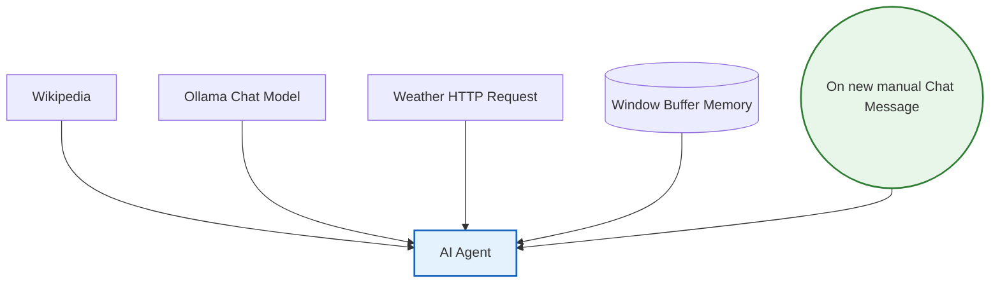

```mermaid
graph TD
    classDef trigger fill:#e8f5e9,stroke:#2e7d32,stroke-width:2px;
    classDef ai fill:#e3f2fd,stroke:#1565c0,stroke-width:2px;
    classDef logic fill:#fff3e0,stroke:#ef6c00,stroke-width:2px;

    On_new_manual_Chat_Message(("On new manual Chat Message")):::trigger
    Wikipedia["Wikipedia"]
    Window_Buffer_Memory[("Window Buffer Memory")]
    AI_Agent["AI Agent"]:::ai
    Weather_HTTP_Request["Weather HTTP Request"]
    Ollama_Chat_Model["Ollama Chat Model"]

    Wikipedia --> AI_Agent
    Ollama_Chat_Model --> AI_Agent
    Weather_HTTP_Request --> AI_Agent
    Window_Buffer_Memory --> AI_Agent
    On_new_manual_Chat_Message --> AI_Agent
```
