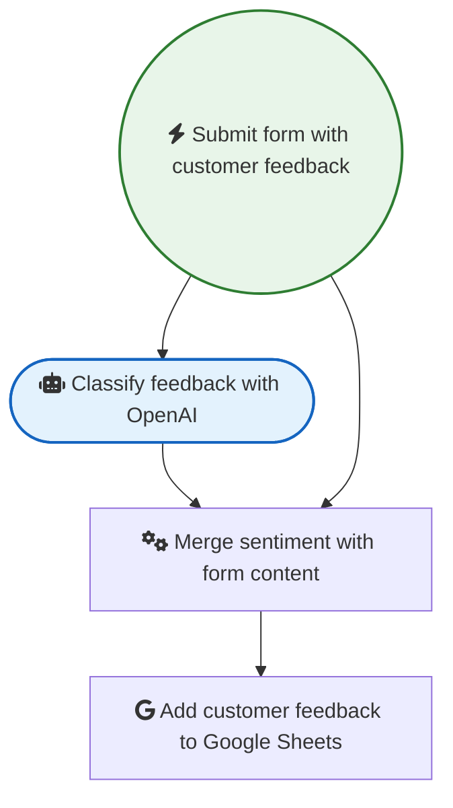

```mermaid
graph TD
    classDef trigger fill:#e8f5e9,stroke:#2e7d32,stroke-width:2px;
    classDef ai fill:#e3f2fd,stroke:#1565c0,stroke-width:2px;
    classDef logic fill:#fff3e0,stroke:#ef6c00,stroke-width:2px;

    Add_customer_feedback_to_Google_Sheets["fab:fa-google Add customer feedback to Google Sheets"]
    Merge_sentiment_with_form_content["fas:fa-cogs Merge sentiment with form content"]
    Classify_feedback_with_OpenAI(["fas:fa-robot Classify feedback with OpenAI"]):::ai
    Submit_form_with_customer_feedback(("fas:fa-bolt Submit form with customer feedback")):::trigger

    Classify_feedback_with_OpenAI --> Merge_sentiment_with_form_content
    Merge_sentiment_with_form_content --> Add_customer_feedback_to_Google_Sheets
    Submit_form_with_customer_feedback --> Classify_feedback_with_OpenAI
    Submit_form_with_customer_feedback --> Merge_sentiment_with_form_content
```
