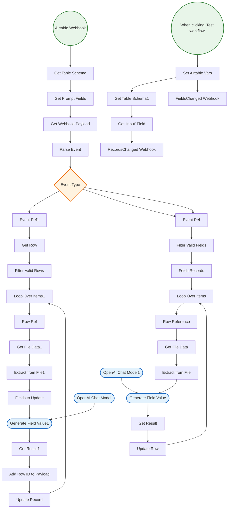

```mermaid
graph TD
    classDef trigger fill:#e8f5e9,stroke:#2e7d32,stroke-width:2px;
    classDef ai fill:#e3f2fd,stroke:#1565c0,stroke-width:2px;
    classDef logic fill:#fff3e0,stroke:#ef6c00,stroke-width:2px;

    Event_Type{"Event Type"}:::logic
    Get_Prompt_Fields["Get Prompt Fields"]
    Get_File_Data["Get File Data"]
    Extract_from_File["Extract from File"]
    Get_Result["Get Result"]
    Loop_Over_Items["Loop Over Items"]
    Row_Reference["Row Reference"]
    Generate_Field_Value(["Generate Field Value"]):::ai
    Fields_to_Update["Fields to Update"]
    Loop_Over_Items1["Loop Over Items1"]
    Row_Ref["Row Ref"]
    Get_File_Data1["Get File Data1"]
    Extract_from_File1["Extract from File1"]
    Get_Result1["Get Result1"]
    Generate_Field_Value1(["Generate Field Value1"]):::ai
    Filter_Valid_Rows["Filter Valid Rows"]
    Filter_Valid_Fields["Filter Valid Fields"]
    Event_Ref["Event Ref"]
    Event_Ref1["Event Ref1"]
    OpenAI_Chat_Model(["OpenAI Chat Model"]):::ai
    OpenAI_Chat_Model1(["OpenAI Chat Model1"]):::ai
    Get_Webhook_Payload["Get Webhook Payload"]
    Parse_Event["Parse Event"]
    Get_Table_Schema["Get Table Schema"]
    Fetch_Records["Fetch Records"]
    Update_Row["Update Row"]
    Get_Row["Get Row"]
    Add_Row_ID_to_Payload["Add Row ID to Payload"]
    Update_Record["Update Record"]
    Airtable_Webhook(("Airtable Webhook")):::trigger
    When_clicking__Test_workflow_(("When clicking ‘Test workflow’")):::trigger
    Set_Airtable_Vars["Set Airtable Vars"]
    Get_Table_Schema1["Get Table Schema1"]
    Get__Input__Field["Get 'Input' Field"]
    RecordsChanged_Webhook["RecordsChanged Webhook"]
    FieldsChanged_Webhook["FieldsChanged Webhook"]

    Get_Row --> Filter_Valid_Rows
    Row_Ref --> Get_File_Data1
    Event_Ref --> Filter_Valid_Fields
    Event_Ref1 --> Get_Row
    Event_Type --> Event_Ref1
    Event_Type --> Event_Ref
    Event_Type --> Event_Ref
    Get_Result --> Update_Row
    Update_Row --> Loop_Over_Items
    Get_Result1 --> Add_Row_ID_to_Payload
    Parse_Event --> Event_Type
    Fetch_Records --> Loop_Over_Items
    Get_File_Data --> Extract_from_File
    Row_Reference --> Get_File_Data
    Update_Record --> Loop_Over_Items1
    Get_File_Data1 --> Extract_from_File1
    Loop_Over_Items --> Row_Reference
    Airtable_Webhook --> Get_Table_Schema
    Fields_to_Update --> Generate_Field_Value1
    Get_Table_Schema --> Get_Prompt_Fields
    Loop_Over_Items1 --> Row_Ref
    Extract_from_File --> Generate_Field_Value
    Filter_Valid_Rows --> Loop_Over_Items1
    Get__Input__Field --> RecordsChanged_Webhook
    Get_Prompt_Fields --> Get_Webhook_Payload
    Get_Table_Schema1 --> Get__Input__Field
    OpenAI_Chat_Model --> Generate_Field_Value1
    Set_Airtable_Vars --> Get_Table_Schema1
    Set_Airtable_Vars --> FieldsChanged_Webhook
    Extract_from_File1 --> Fields_to_Update
    OpenAI_Chat_Model1 --> Generate_Field_Value
    Filter_Valid_Fields --> Fetch_Records
    Get_Webhook_Payload --> Parse_Event
    Generate_Field_Value --> Get_Result
    Add_Row_ID_to_Payload --> Update_Record
    Generate_Field_Value1 --> Get_Result1
    When_clicking__Test_workflow_ --> Set_Airtable_Vars
```
