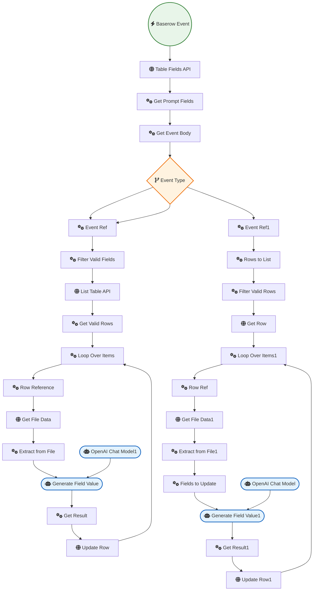

```mermaid
graph TD
    classDef trigger fill:#e8f5e9,stroke:#2e7d32,stroke-width:2px;
    classDef ai fill:#e3f2fd,stroke:#1565c0,stroke-width:2px;
    classDef logic fill:#fff3e0,stroke:#ef6c00,stroke-width:2px;

    Baserow_Event(("fas:fa-bolt Baserow Event")):::trigger
    Event_Type{"fas:fa-code-branch Event Type"}:::logic
    Table_Fields_API["fas:fa-globe Table Fields API"]
    Get_Prompt_Fields["fas:fa-cogs Get Prompt Fields"]
    Get_Event_Body["fas:fa-cogs Get Event Body"]
    List_Table_API["fas:fa-globe List Table API"]
    Get_Valid_Rows["fas:fa-cogs Get Valid Rows"]
    Get_File_Data["fas:fa-globe Get File Data"]
    Extract_from_File["fas:fa-cogs Extract from File"]
    Update_Row["fas:fa-globe Update Row"]
    Get_Result["fas:fa-cogs Get Result"]
    Loop_Over_Items["fas:fa-cogs Loop Over Items"]
    Row_Reference["fas:fa-cogs Row Reference"]
    Generate_Field_Value(["fas:fa-robot Generate Field Value"]):::ai
    Get_Row["fas:fa-globe Get Row"]
    Rows_to_List["fas:fa-cogs Rows to List"]
    Fields_to_Update["fas:fa-cogs Fields to Update"]
    Loop_Over_Items1["fas:fa-cogs Loop Over Items1"]
    Row_Ref["fas:fa-cogs Row Ref"]
    Get_File_Data1["fas:fa-globe Get File Data1"]
    Extract_from_File1["fas:fa-cogs Extract from File1"]
    Update_Row1["fas:fa-globe Update Row1"]
    Get_Result1["fas:fa-cogs Get Result1"]
    Generate_Field_Value1(["fas:fa-robot Generate Field Value1"]):::ai
    Filter_Valid_Rows["fas:fa-cogs Filter Valid Rows"]
    Filter_Valid_Fields["fas:fa-cogs Filter Valid Fields"]
    Event_Ref["fas:fa-cogs Event Ref"]
    Event_Ref1["fas:fa-cogs Event Ref1"]
    OpenAI_Chat_Model(["fas:fa-robot OpenAI Chat Model"]):::ai
    OpenAI_Chat_Model1(["fas:fa-robot OpenAI Chat Model1"]):::ai

    Get_Row --> Loop_Over_Items1
    Row_Ref --> Get_File_Data1
    Event_Ref --> Filter_Valid_Fields
    Event_Ref1 --> Rows_to_List
    Event_Type --> Event_Ref1
    Event_Type --> Event_Ref
    Event_Type --> Event_Ref
    Get_Result --> Update_Row
    Update_Row --> Loop_Over_Items
    Get_Result1 --> Update_Row1
    Update_Row1 --> Loop_Over_Items1
    Rows_to_List --> Filter_Valid_Rows
    Baserow_Event --> Table_Fields_API
    Get_File_Data --> Extract_from_File
    Row_Reference --> Get_File_Data
    Get_Event_Body --> Event_Type
    Get_File_Data1 --> Extract_from_File1
    Get_Valid_Rows --> Loop_Over_Items
    List_Table_API --> Get_Valid_Rows
    Loop_Over_Items --> Row_Reference
    Fields_to_Update --> Generate_Field_Value1
    Loop_Over_Items1 --> Row_Ref
    Table_Fields_API --> Get_Prompt_Fields
    Extract_from_File --> Generate_Field_Value
    Filter_Valid_Rows --> Get_Row
    Get_Prompt_Fields --> Get_Event_Body
    OpenAI_Chat_Model --> Generate_Field_Value1
    Extract_from_File1 --> Fields_to_Update
    OpenAI_Chat_Model1 --> Generate_Field_Value
    Filter_Valid_Fields --> List_Table_API
    Generate_Field_Value --> Get_Result
    Generate_Field_Value1 --> Get_Result1
```
