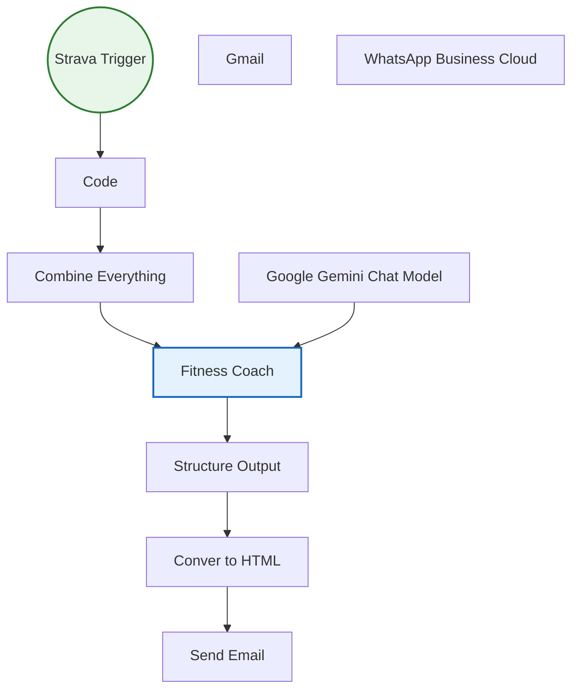

```mermaid
graph TD
    classDef trigger fill:#e8f5e9,stroke:#2e7d32,stroke-width:2px;
    classDef ai fill:#e3f2fd,stroke:#1565c0,stroke-width:2px;
    classDef logic fill:#fff3e0,stroke:#ef6c00,stroke-width:2px;

    Strava_Trigger(("Strava Trigger")):::trigger
    Google_Gemini_Chat_Model["Google Gemini Chat Model"]
    Gmail["Gmail"]
    Combine_Everything["Combine Everything"]
    Fitness_Coach["Fitness Coach"]:::ai
    Structure_Output["Structure Output"]
    Conver_to_HTML["Conver to HTML"]
    Send_Email["Send Email"]
    Code["Code"]
    WhatsApp_Business_Cloud["WhatsApp Business Cloud"]

    Code --> Combine_Everything
    Fitness_Coach --> Structure_Output
    Conver_to_HTML --> Send_Email
    Strava_Trigger --> Code
    Structure_Output --> Conver_to_HTML
    Combine_Everything --> Fitness_Coach
    Google_Gemini_Chat_Model --> Fitness_Coach
```
