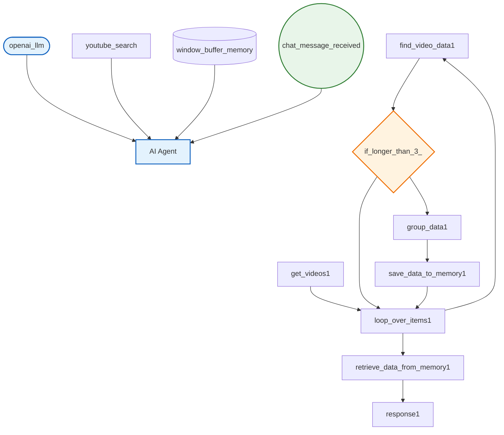

```mermaid
graph TD
    classDef trigger fill:#e8f5e9,stroke:#2e7d32,stroke-width:2px;
    classDef ai fill:#e3f2fd,stroke:#1565c0,stroke-width:2px;
    classDef logic fill:#fff3e0,stroke:#ef6c00,stroke-width:2px;

    AI_Agent["AI Agent"]:::ai
    chat_message_received(("chat_message_received")):::trigger
    youtube_search["youtube_search"]
    openai_llm(["openai_llm"]):::ai
    window_buffer_memory[("window_buffer_memory")]
    find_video_data1["find_video_data1"]
    get_videos1["get_videos1"]
    response1["response1"]
    group_data1["group_data1"]
    save_data_to_memory1["save_data_to_memory1"]
    retrieve_data_from_memory1["retrieve_data_from_memory1"]
    loop_over_items1["loop_over_items1"]
    if_longer_than_3_{"if_longer_than_3_"}:::logic

    openai_llm --> AI_Agent
    get_videos1 --> loop_over_items1
    group_data1 --> save_data_to_memory1
    youtube_search --> AI_Agent
    find_video_data1 --> if_longer_than_3_
    loop_over_items1 --> retrieve_data_from_memory1
    loop_over_items1 --> find_video_data1
    if_longer_than_3_ --> group_data1
    if_longer_than_3_ --> loop_over_items1
    save_data_to_memory1 --> loop_over_items1
    window_buffer_memory --> AI_Agent
    chat_message_received --> AI_Agent
    retrieve_data_from_memory1 --> response1
```
