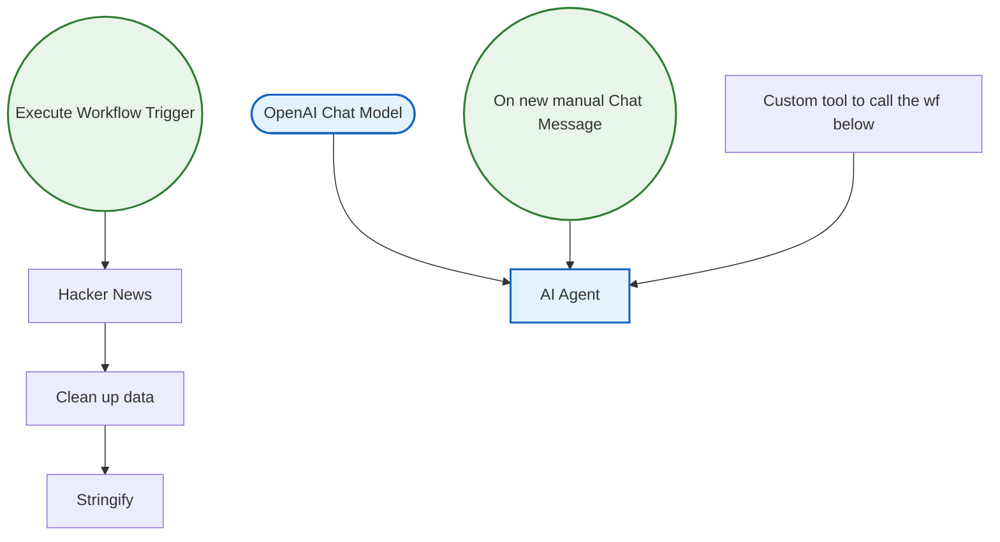

```mermaid
graph TD
    classDef trigger fill:#e8f5e9,stroke:#2e7d32,stroke-width:2px;
    classDef ai fill:#e3f2fd,stroke:#1565c0,stroke-width:2px;
    classDef logic fill:#fff3e0,stroke:#ef6c00,stroke-width:2px;

    On_new_manual_Chat_Message(("On new manual Chat Message")):::trigger
    Execute_Workflow_Trigger(("Execute Workflow Trigger")):::trigger
    Hacker_News["Hacker News"]
    Clean_up_data["Clean up data"]
    AI_Agent["AI Agent"]:::ai
    OpenAI_Chat_Model(["OpenAI Chat Model"]):::ai
    Stringify["Stringify"]
    Custom_tool_to_call_the_wf_below["Custom tool to call the wf below"]

    Hacker_News --> Clean_up_data
    Clean_up_data --> Stringify
    OpenAI_Chat_Model --> AI_Agent
    Execute_Workflow_Trigger --> Hacker_News
    On_new_manual_Chat_Message --> AI_Agent
    Custom_tool_to_call_the_wf_below --> AI_Agent
```
