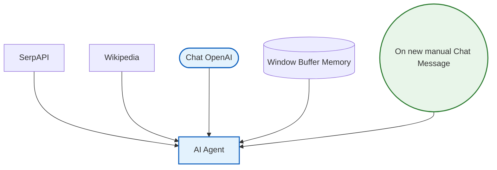

```mermaid
graph TD
    classDef trigger fill:#e8f5e9,stroke:#2e7d32,stroke-width:2px;
    classDef ai fill:#e3f2fd,stroke:#1565c0,stroke-width:2px;
    classDef logic fill:#fff3e0,stroke:#ef6c00,stroke-width:2px;

    On_new_manual_Chat_Message(("On new manual Chat Message")):::trigger
    Chat_OpenAI(["Chat OpenAI"]):::ai
    Wikipedia["Wikipedia"]
    Window_Buffer_Memory[("Window Buffer Memory")]
    SerpAPI["SerpAPI"]
    AI_Agent["AI Agent"]:::ai

    SerpAPI --> AI_Agent
    Wikipedia --> AI_Agent
    Chat_OpenAI --> AI_Agent
    Window_Buffer_Memory --> AI_Agent
    On_new_manual_Chat_Message --> AI_Agent
```
