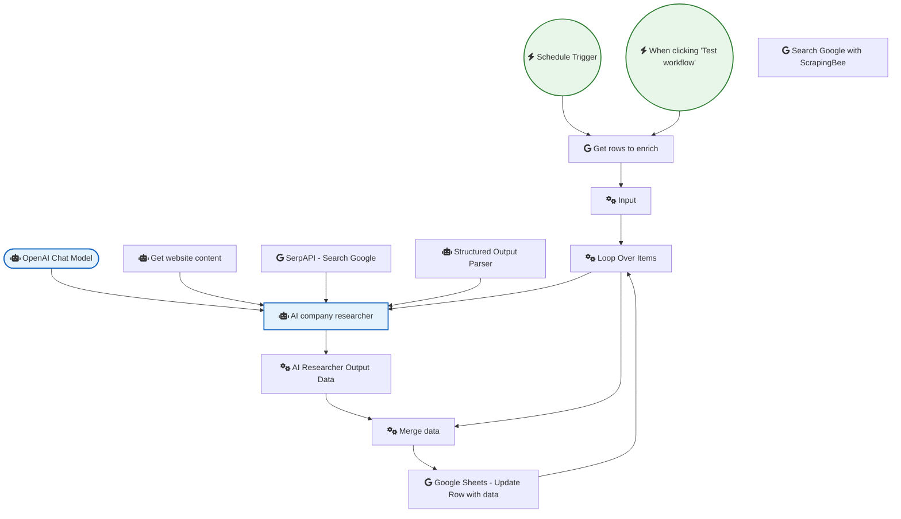

```mermaid
graph TD
    classDef trigger fill:#e8f5e9,stroke:#2e7d32,stroke-width:2px;
    classDef ai fill:#e3f2fd,stroke:#1565c0,stroke-width:2px;
    classDef logic fill:#fff3e0,stroke:#ef6c00,stroke-width:2px;

    When_clicking__Test_workflow_(("fas:fa-bolt When clicking 'Test workflow'")):::trigger
    Input["fas:fa-cogs Input"]
    OpenAI_Chat_Model(["fas:fa-robot OpenAI Chat Model"]):::ai
    Get_website_content["fas:fa-robot Get website content"]
    SerpAPI___Search_Google["fab:fa-google SerpAPI - Search Google"]
    Structured_Output_Parser["fas:fa-robot Structured Output Parser"]
    Loop_Over_Items["fas:fa-cogs Loop Over Items"]
    AI_Researcher_Output_Data["fas:fa-cogs AI Researcher Output Data"]
    Google_Sheets___Update_Row_with_data["fab:fa-google Google Sheets - Update Row with data"]
    Merge_data["fas:fa-cogs Merge data"]
    Get_rows_to_enrich["fab:fa-google Get rows to enrich"]
    Schedule_Trigger(("fas:fa-bolt Schedule Trigger")):::trigger
    AI_company_researcher["fas:fa-robot AI company researcher"]:::ai
    Search_Google_with_ScrapingBee["fab:fa-google Search Google with ScrapingBee"]

    Input --> Loop_Over_Items
    Merge_data --> Google_Sheets___Update_Row_with_data
    Loop_Over_Items --> AI_company_researcher
    Loop_Over_Items --> Merge_data
    Schedule_Trigger --> Get_rows_to_enrich
    OpenAI_Chat_Model --> AI_company_researcher
    Get_rows_to_enrich --> Input
    Get_website_content --> AI_company_researcher
    AI_company_researcher --> AI_Researcher_Output_Data
    SerpAPI___Search_Google --> AI_company_researcher
    Structured_Output_Parser --> AI_company_researcher
    AI_Researcher_Output_Data --> Merge_data
    When_clicking__Test_workflow_ --> Get_rows_to_enrich
    Google_Sheets___Update_Row_with_data --> Loop_Over_Items
```
