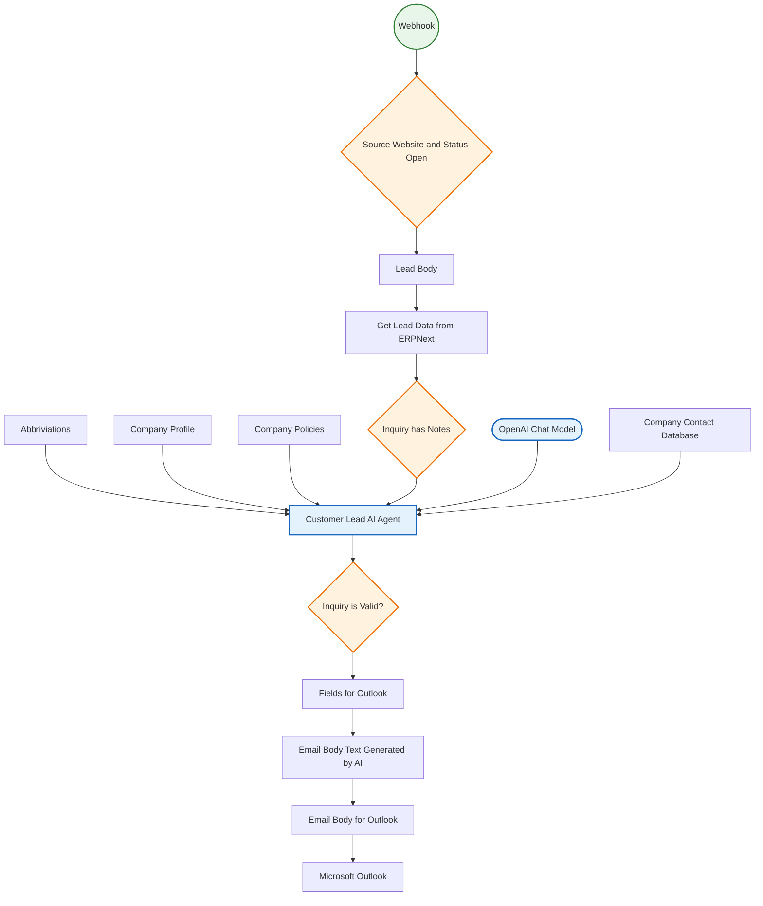

```mermaid
graph TD
    classDef trigger fill:#e8f5e9,stroke:#2e7d32,stroke-width:2px;
    classDef ai fill:#e3f2fd,stroke:#1565c0,stroke-width:2px;
    classDef logic fill:#fff3e0,stroke:#ef6c00,stroke-width:2px;

    Customer_Lead_AI_Agent["Customer Lead AI Agent"]:::ai
    OpenAI_Chat_Model(["OpenAI Chat Model"]):::ai
    Abbriviations["Abbriviations"]
    Lead_Body["Lead Body"]
    Source_Website_and_Status_Open{"Source Website and Status Open"}:::logic
    Microsoft_Outlook["Microsoft Outlook"]
    Email_Body_Text_Generated_by_AI["Email Body Text Generated by AI"]
    Fields_for_Outlook["Fields for Outlook"]
    Email_Body_for_Outlook["Email Body for Outlook"]
    Inquiry_has_Notes{"Inquiry has Notes"}:::logic
    Inquiry_is_Valid_{"Inquiry is Valid?"}:::logic
    Company_Profile["Company Profile"]
    Company_Policies["Company Policies"]
    Company_Contact_Database["Company Contact Database"]
    Get_Lead_Data_from_ERPNext["Get Lead Data from ERPNext"]
    Webhook(("Webhook")):::trigger

    Webhook --> Source_Website_and_Status_Open
    Lead_Body --> Get_Lead_Data_from_ERPNext
    Abbriviations --> Customer_Lead_AI_Agent
    Company_Profile --> Customer_Lead_AI_Agent
    Company_Policies --> Customer_Lead_AI_Agent
    Inquiry_has_Notes --> Customer_Lead_AI_Agent
    Inquiry_is_Valid_ --> Fields_for_Outlook
    OpenAI_Chat_Model --> Customer_Lead_AI_Agent
    Fields_for_Outlook --> Email_Body_Text_Generated_by_AI
    Customer_Lead_AI_Agent --> Inquiry_is_Valid_
    Email_Body_for_Outlook --> Microsoft_Outlook
    Company_Contact_Database --> Customer_Lead_AI_Agent
    Get_Lead_Data_from_ERPNext --> Inquiry_has_Notes
    Source_Website_and_Status_Open --> Lead_Body
    Email_Body_Text_Generated_by_AI --> Email_Body_for_Outlook
```
