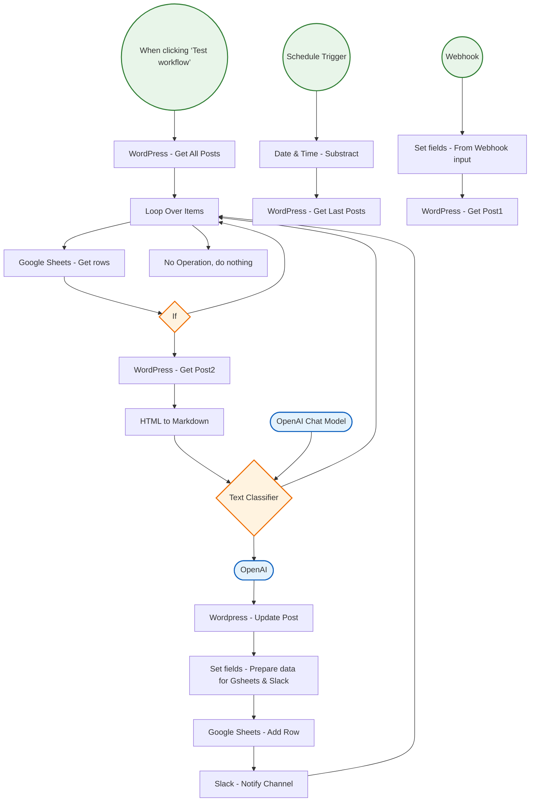

```mermaid
graph TD
    classDef trigger fill:#e8f5e9,stroke:#2e7d32,stroke-width:2px;
    classDef ai fill:#e3f2fd,stroke:#1565c0,stroke-width:2px;
    classDef logic fill:#fff3e0,stroke:#ef6c00,stroke-width:2px;

    When_clicking__Test_workflow_(("When clicking ‘Test workflow’")):::trigger
    Text_Classifier{"Text Classifier"}:::logic
    OpenAI_Chat_Model(["OpenAI Chat Model"]):::ai
    Loop_Over_Items["Loop Over Items"]
    If{"If"}:::logic
    Webhook(("Webhook")):::trigger
    Schedule_Trigger(("Schedule Trigger")):::trigger
    Wordpress___Update_Post["Wordpress - Update Post"]
    Google_Sheets___Get_rows["Google Sheets - Get rows"]
    HTML_to_Markdown["HTML to Markdown"]
    OpenAI(["OpenAI"]):::ai
    Google_Sheets___Add_Row["Google Sheets - Add Row"]
    Slack___Notify_Channel["Slack - Notify Channel"]
    Set_fields___From_Webhook_input["Set fields - From Webhook input"]
    Date___Time___Substract["Date & Time - Substract"]
    Set_fields___Prepare_data_for_Gsheets___Slack["Set fields - Prepare data for Gsheets & Slack"]
    WordPress___Get_Post2["WordPress - Get Post2"]
    No_Operation__do_nothing["No Operation, do nothing"]
    WordPress___Get_Last_Posts["WordPress - Get Last Posts"]
    WordPress___Get_Post1["WordPress - Get Post1"]
    WordPress___Get_All_Posts["WordPress - Get All Posts"]

    If --> Loop_Over_Items
    If --> WordPress___Get_Post2
    OpenAI --> Wordpress___Update_Post
    Webhook --> Set_fields___From_Webhook_input
    Loop_Over_Items --> No_Operation__do_nothing
    Loop_Over_Items --> Google_Sheets___Get_rows
    Text_Classifier --> OpenAI
    Text_Classifier --> Loop_Over_Items
    HTML_to_Markdown --> Text_Classifier
    Schedule_Trigger --> Date___Time___Substract
    OpenAI_Chat_Model --> Text_Classifier
    WordPress___Get_Post2 --> HTML_to_Markdown
    Slack___Notify_Channel --> Loop_Over_Items
    Date___Time___Substract --> WordPress___Get_Last_Posts
    Google_Sheets___Add_Row --> Slack___Notify_Channel
    Wordpress___Update_Post --> Set_fields___Prepare_data_for_Gsheets___Slack
    Google_Sheets___Get_rows --> If
    WordPress___Get_All_Posts --> Loop_Over_Items
    Set_fields___From_Webhook_input --> WordPress___Get_Post1
    When_clicking__Test_workflow_ --> WordPress___Get_All_Posts
    Set_fields___Prepare_data_for_Gsheets___Slack --> Google_Sheets___Add_Row
```
