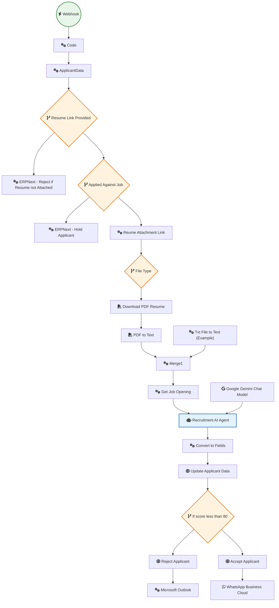

```mermaid
graph TD
    classDef trigger fill:#e8f5e9,stroke:#2e7d32,stroke-width:2px;
    classDef ai fill:#e3f2fd,stroke:#1565c0,stroke-width:2px;
    classDef logic fill:#fff3e0,stroke:#ef6c00,stroke-width:2px;

    Code["fas:fa-cogs Code"]
    ApplicantData["fas:fa-cogs ApplicantData"]
    ERPNext___Reject_if_Resume_not_Attached["fas:fa-cogs ERPNext - Reject if Resume not Attached"]
    Applied_Against_Job{"fas:fa-code-branch Applied Against Job"}:::logic
    ERPNext___Hold_Applicant["fas:fa-cogs ERPNext - Hold Applicant"]
    Get_Job_Opening["fas:fa-cogs Get Job Opening"]
    Google_Gemini_Chat_Model["fab:fa-google Google Gemini Chat Model"]
    Convert_to_Fields["fas:fa-cogs Convert to Fields"]
    If_score_less_than_80{"fas:fa-code-branch If score less than 80"}:::logic
    Reject_Applicant["fas:fa-globe Reject Applicant"]
    Update_Applicant_Data["fas:fa-globe Update Applicant Data"]
    Reume_Attachment_Link["fas:fa-cogs Reume Attachment Link"]
    Resume_Link_Provided{"fas:fa-code-branch Resume Link Provided"}:::logic
    Accept_Applicant["fas:fa-globe Accept Applicant"]
    Webhook(("fas:fa-bolt Webhook")):::trigger
    File_Type{"fas:fa-code-branch File Type"}:::logic
    Download_PDF_Resume["fas:fa-file-pdf Download PDF Resume"]
    PDF_to_Text["fas:fa-file-pdf PDF to Text"]
    Txt_File_to_Text__Example_["fas:fa-cogs Txt File to Text (Example)"]
    Merge1["fas:fa-cogs Merge1"]
    Recruitment_AI_Agent["fas:fa-robot Recruitment AI Agent"]:::ai
    Microsoft_Outlook["fas:fa-cogs Microsoft Outlook"]
    WhatsApp_Business_Cloud["fab:fa-whatsapp WhatsApp Business Cloud"]

    Code --> ApplicantData
    Merge1 --> Get_Job_Opening
    Webhook --> Code
    File_Type --> Download_PDF_Resume
    PDF_to_Text --> Merge1
    ApplicantData --> Resume_Link_Provided
    Get_Job_Opening --> Recruitment_AI_Agent
    Accept_Applicant --> WhatsApp_Business_Cloud
    Reject_Applicant --> Microsoft_Outlook
    Convert_to_Fields --> Update_Applicant_Data
    Applied_Against_Job --> Reume_Attachment_Link
    Applied_Against_Job --> ERPNext___Hold_Applicant
    Download_PDF_Resume --> PDF_to_Text
    Recruitment_AI_Agent --> Convert_to_Fields
    Resume_Link_Provided --> Applied_Against_Job
    Resume_Link_Provided --> ERPNext___Reject_if_Resume_not_Attached
    If_score_less_than_80 --> Reject_Applicant
    If_score_less_than_80 --> Accept_Applicant
    Reume_Attachment_Link --> File_Type
    Update_Applicant_Data --> If_score_less_than_80
    Google_Gemini_Chat_Model --> Recruitment_AI_Agent
    Txt_File_to_Text__Example_ --> Merge1
```
