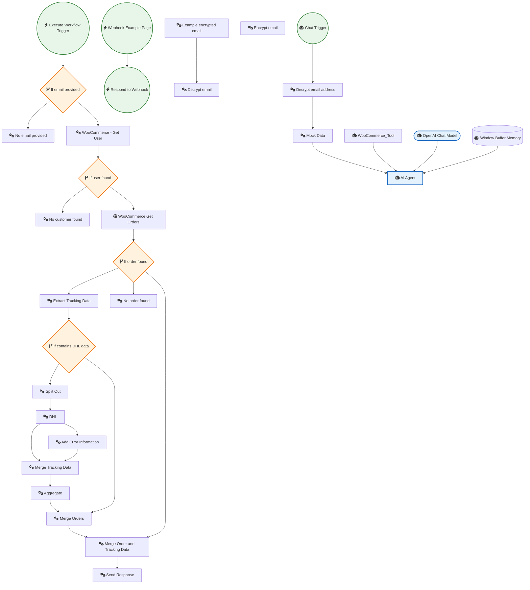

```mermaid
graph TD
    classDef trigger fill:#e8f5e9,stroke:#2e7d32,stroke-width:2px;
    classDef ai fill:#e3f2fd,stroke:#1565c0,stroke-width:2px;
    classDef logic fill:#fff3e0,stroke:#ef6c00,stroke-width:2px;

    No_email_provided["fas:fa-cogs No email provided"]
    If_email_provided{"fas:fa-code-branch If email provided"}:::logic
    If_user_found{"fas:fa-code-branch If user found"}:::logic
    No_customer_found["fas:fa-cogs No customer found"]
    If_contains_DHL_data{"fas:fa-code-branch If contains DHL data"}:::logic
    Extract_Tracking_Data["fas:fa-cogs Extract Tracking Data"]
    Merge_Orders["fas:fa-cogs Merge Orders"]
    Merge_Order_and_Tracking_Data["fas:fa-cogs Merge Order and Tracking Data"]
    Split_Out["fas:fa-cogs Split Out"]
    Aggregate["fas:fa-cogs Aggregate"]
    Merge_Tracking_Data["fas:fa-cogs Merge Tracking Data"]
    Window_Buffer_Memory[("fas:fa-robot Window Buffer Memory")]
    Execute_Workflow_Trigger(("fas:fa-bolt Execute Workflow Trigger")):::trigger
    WooCommerce___Get_User["fas:fa-cogs WooCommerce - Get User"]
    If_order_found{"fas:fa-code-branch If order found"}:::logic
    WooCommerce_Get_Orders["fas:fa-globe WooCommerce Get Orders"]
    No_order_found["fas:fa-cogs No order found"]
    Add_Error_Information["fas:fa-cogs Add Error Information"]
    DHL["fas:fa-cogs DHL"]
    Send_Response["fas:fa-cogs Send Response"]
    OpenAI_Chat_Model(["fas:fa-robot OpenAI Chat Model"]):::ai
    WooCommerce_Tool["fas:fa-robot WooCommerce_Tool"]
    Chat_Trigger(("fas:fa-robot Chat Trigger")):::trigger
    Respond_to_Webhook(("fas:fa-bolt Respond to Webhook")):::trigger
    Webhook_Example_Page(("fas:fa-bolt Webhook Example Page")):::trigger
    Decrypt_email["fas:fa-cogs Decrypt email"]
    Encrypt_email["fas:fa-cogs Encrypt email"]
    Example_encrypted_email["fas:fa-cogs Example encrypted email"]
    Decrypt_email_address["fas:fa-cogs Decrypt email address"]
    AI_Agent["fas:fa-robot AI Agent"]:::ai
    Mock_Data["fas:fa-cogs Mock Data"]

    DHL --> Merge_Tracking_Data
    DHL --> Add_Error_Information
    Aggregate --> Merge_Orders
    Mock_Data --> AI_Agent
    Split_Out --> DHL
    Chat_Trigger --> Decrypt_email_address
    Merge_Orders --> Merge_Order_and_Tracking_Data
    If_user_found --> WooCommerce_Get_Orders
    If_user_found --> No_customer_found
    If_order_found --> Extract_Tracking_Data
    If_order_found --> Merge_Order_and_Tracking_Data
    If_order_found --> No_order_found
    WooCommerce_Tool --> AI_Agent
    If_email_provided --> WooCommerce___Get_User
    If_email_provided --> No_email_provided
    OpenAI_Chat_Model --> AI_Agent
    Merge_Tracking_Data --> Aggregate
    If_contains_DHL_data --> Split_Out
    If_contains_DHL_data --> Merge_Orders
    Webhook_Example_Page --> Respond_to_Webhook
    Window_Buffer_Memory --> AI_Agent
    Add_Error_Information --> Merge_Tracking_Data
    Decrypt_email_address --> Mock_Data
    Extract_Tracking_Data --> If_contains_DHL_data
    WooCommerce___Get_User --> If_user_found
    WooCommerce_Get_Orders --> If_order_found
    Example_encrypted_email --> Decrypt_email
    Execute_Workflow_Trigger --> If_email_provided
    Merge_Order_and_Tracking_Data --> Send_Response
```
