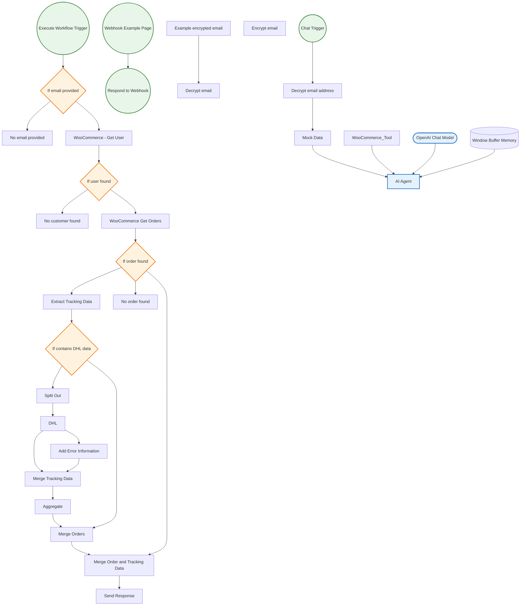

```mermaid
graph TD
    classDef trigger fill:#e8f5e9,stroke:#2e7d32,stroke-width:2px;
    classDef ai fill:#e3f2fd,stroke:#1565c0,stroke-width:2px;
    classDef logic fill:#fff3e0,stroke:#ef6c00,stroke-width:2px;

    No_email_provided["No email provided"]
    If_email_provided{"If email provided"}:::logic
    If_user_found{"If user found"}:::logic
    No_customer_found["No customer found"]
    If_contains_DHL_data{"If contains DHL data"}:::logic
    Extract_Tracking_Data["Extract Tracking Data"]
    Merge_Orders["Merge Orders"]
    Merge_Order_and_Tracking_Data["Merge Order and Tracking Data"]
    Split_Out["Split Out"]
    Aggregate["Aggregate"]
    Merge_Tracking_Data["Merge Tracking Data"]
    Window_Buffer_Memory[("Window Buffer Memory")]
    Execute_Workflow_Trigger(("Execute Workflow Trigger")):::trigger
    WooCommerce___Get_User["WooCommerce - Get User"]
    If_order_found{"If order found"}:::logic
    WooCommerce_Get_Orders["WooCommerce Get Orders"]
    No_order_found["No order found"]
    Add_Error_Information["Add Error Information"]
    DHL["DHL"]
    Send_Response["Send Response"]
    OpenAI_Chat_Model(["OpenAI Chat Model"]):::ai
    WooCommerce_Tool["WooCommerce_Tool"]
    Chat_Trigger(("Chat Trigger")):::trigger
    Respond_to_Webhook(("Respond to Webhook")):::trigger
    Webhook_Example_Page(("Webhook Example Page")):::trigger
    Decrypt_email["Decrypt email"]
    Encrypt_email["Encrypt email"]
    Example_encrypted_email["Example encrypted email"]
    Decrypt_email_address["Decrypt email address"]
    AI_Agent["AI Agent"]:::ai
    Mock_Data["Mock Data"]

    DHL --> Merge_Tracking_Data
    DHL --> Add_Error_Information
    Aggregate --> Merge_Orders
    Mock_Data --> AI_Agent
    Split_Out --> DHL
    Chat_Trigger --> Decrypt_email_address
    Merge_Orders --> Merge_Order_and_Tracking_Data
    If_user_found --> WooCommerce_Get_Orders
    If_user_found --> No_customer_found
    If_order_found --> Extract_Tracking_Data
    If_order_found --> Merge_Order_and_Tracking_Data
    If_order_found --> No_order_found
    WooCommerce_Tool --> AI_Agent
    If_email_provided --> WooCommerce___Get_User
    If_email_provided --> No_email_provided
    OpenAI_Chat_Model --> AI_Agent
    Merge_Tracking_Data --> Aggregate
    If_contains_DHL_data --> Split_Out
    If_contains_DHL_data --> Merge_Orders
    Webhook_Example_Page --> Respond_to_Webhook
    Window_Buffer_Memory --> AI_Agent
    Add_Error_Information --> Merge_Tracking_Data
    Decrypt_email_address --> Mock_Data
    Extract_Tracking_Data --> If_contains_DHL_data
    WooCommerce___Get_User --> If_user_found
    WooCommerce_Get_Orders --> If_order_found
    Example_encrypted_email --> Decrypt_email
    Execute_Workflow_Trigger --> If_email_provided
    Merge_Order_and_Tracking_Data --> Send_Response
```
