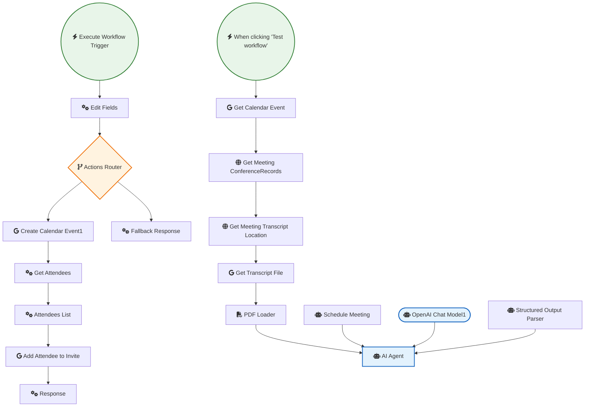

```mermaid
graph TD
    classDef trigger fill:#e8f5e9,stroke:#2e7d32,stroke-width:2px;
    classDef ai fill:#e3f2fd,stroke:#1565c0,stroke-width:2px;
    classDef logic fill:#fff3e0,stroke:#ef6c00,stroke-width:2px;

    OpenAI_Chat_Model1(["fas:fa-robot OpenAI Chat Model1"]):::ai
    Get_Meeting_ConferenceRecords["fas:fa-globe Get Meeting ConferenceRecords"]
    Get_Meeting_Transcript_Location["fas:fa-globe Get Meeting Transcript Location"]
    Get_Transcript_File["fab:fa-google Get Transcript File"]
    When_clicking__Test_workflow_(("fas:fa-bolt When clicking 'Test workflow'")):::trigger
    PDF_Loader["fas:fa-file-pdf PDF Loader"]
    Get_Calendar_Event["fab:fa-google Get Calendar Event"]
    Structured_Output_Parser["fas:fa-robot Structured Output Parser"]
    Execute_Workflow_Trigger(("fas:fa-bolt Execute Workflow Trigger")):::trigger
    Response["fas:fa-cogs Response"]
    Edit_Fields["fas:fa-cogs Edit Fields"]
    Fallback_Response["fas:fa-cogs Fallback Response"]
    Actions_Router{"fas:fa-code-branch Actions Router"}:::logic
    Get_Attendees["fas:fa-cogs Get Attendees"]
    Attendees_List["fas:fa-cogs Attendees List"]
    Add_Attendee_to_Invite["fab:fa-google Add Attendee to Invite"]
    Create_Calendar_Event1["fab:fa-google Create Calendar Event1"]
    Schedule_Meeting["fas:fa-robot Schedule Meeting"]
    AI_Agent["fas:fa-robot AI Agent"]:::ai

    PDF_Loader --> AI_Agent
    Edit_Fields --> Actions_Router
    Get_Attendees --> Attendees_List
    Actions_Router --> Create_Calendar_Event1
    Actions_Router --> Fallback_Response
    Attendees_List --> Add_Attendee_to_Invite
    Schedule_Meeting --> AI_Agent
    Get_Calendar_Event --> Get_Meeting_ConferenceRecords
    OpenAI_Chat_Model1 --> AI_Agent
    Get_Transcript_File --> PDF_Loader
    Add_Attendee_to_Invite --> Response
    Create_Calendar_Event1 --> Get_Attendees
    Execute_Workflow_Trigger --> Edit_Fields
    Structured_Output_Parser --> AI_Agent
    Get_Meeting_ConferenceRecords --> Get_Meeting_Transcript_Location
    When_clicking__Test_workflow_ --> Get_Calendar_Event
    Get_Meeting_Transcript_Location --> Get_Transcript_File
```
