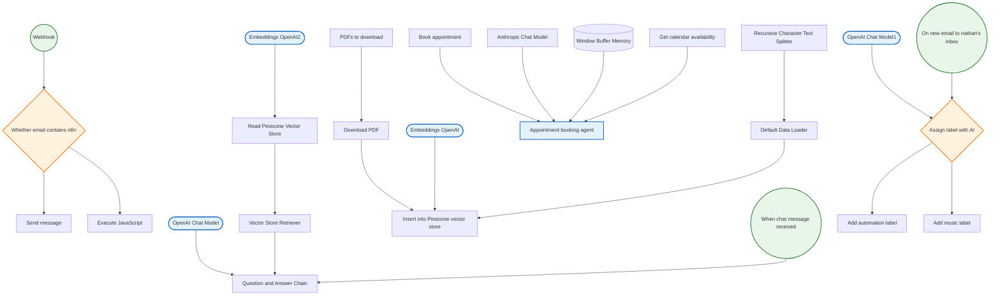

```mermaid
graph TD
    classDef trigger fill:#e8f5e9,stroke:#2e7d32,stroke-width:2px;
    classDef ai fill:#e3f2fd,stroke:#1565c0,stroke-width:2px;
    classDef logic fill:#fff3e0,stroke:#ef6c00,stroke-width:2px;

    Send_message["Send message"]
    Execute_JavaScript["Execute JavaScript"]
    Recursive_Character_Text_Splitter["Recursive Character Text Splitter"]
    Embeddings_OpenAI(["Embeddings OpenAI"]):::ai
    Default_Data_Loader["Default Data Loader"]
    OpenAI_Chat_Model(["OpenAI Chat Model"]):::ai
    Embeddings_OpenAI2(["Embeddings OpenAI2"]):::ai
    Vector_Store_Retriever["Vector Store Retriever"]
    Download_PDF["Download PDF"]
    PDFs_to_download["PDFs to download"]
    Read_Pinecone_Vector_Store["Read Pinecone Vector Store"]
    Question_and_Answer_Chain["Question and Answer Chain"]
    Anthropic_Chat_Model["Anthropic Chat Model"]
    Get_calendar_availability["Get calendar availability"]
    Appointment_booking_agent["Appointment booking agent"]:::ai
    Window_Buffer_Memory[("Window Buffer Memory")]
    Insert_into_Pinecone_vector_store["Insert into Pinecone vector store"]
    Book_appointment["Book appointment"]
    When_chat_message_received(("When chat message received")):::trigger
    OpenAI_Chat_Model1(["OpenAI Chat Model1"]):::ai
    Add_automation_label["Add automation label"]
    On_new_email_to_nathan_s_inbox(("On new email to nathan's inbox")):::trigger
    Add_music_label["Add music label"]
    Assign_label_with_AI{"Assign label with AI"}:::logic
    Webhook(("Webhook")):::trigger
    Whether_email_contains_n8n{"Whether email contains n8n"}:::logic

    Webhook --> Whether_email_contains_n8n
    Download_PDF --> Insert_into_Pinecone_vector_store
    Book_appointment --> Appointment_booking_agent
    PDFs_to_download --> Download_PDF
    Embeddings_OpenAI --> Insert_into_Pinecone_vector_store
    OpenAI_Chat_Model --> Question_and_Answer_Chain
    Embeddings_OpenAI2 --> Read_Pinecone_Vector_Store
    OpenAI_Chat_Model1 --> Assign_label_with_AI
    Default_Data_Loader --> Insert_into_Pinecone_vector_store
    Anthropic_Chat_Model --> Appointment_booking_agent
    Assign_label_with_AI --> Add_automation_label
    Assign_label_with_AI --> Add_music_label
    Window_Buffer_Memory --> Appointment_booking_agent
    Vector_Store_Retriever --> Question_and_Answer_Chain
    Get_calendar_availability --> Appointment_booking_agent
    Read_Pinecone_Vector_Store --> Vector_Store_Retriever
    When_chat_message_received --> Question_and_Answer_Chain
    Whether_email_contains_n8n --> Execute_JavaScript
    Whether_email_contains_n8n --> Send_message
    On_new_email_to_nathan_s_inbox --> Assign_label_with_AI
    Recursive_Character_Text_Splitter --> Default_Data_Loader
```
