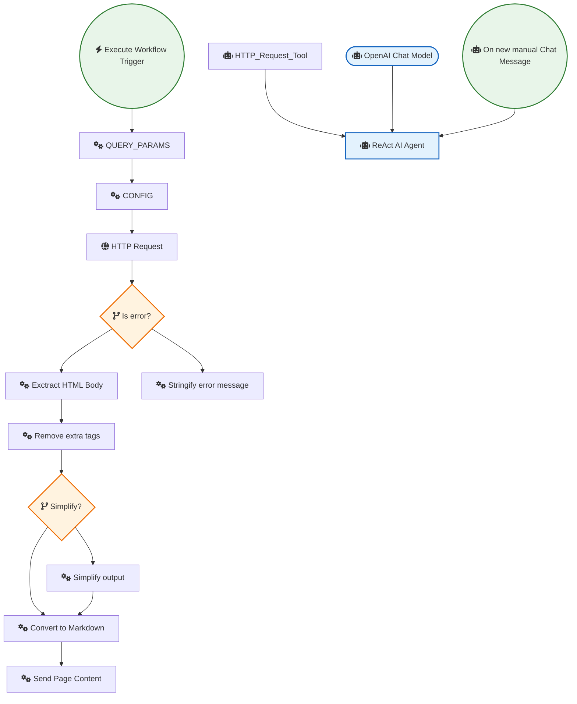

```mermaid
graph TD
    classDef trigger fill:#e8f5e9,stroke:#2e7d32,stroke-width:2px;
    classDef ai fill:#e3f2fd,stroke:#1565c0,stroke-width:2px;
    classDef logic fill:#fff3e0,stroke:#ef6c00,stroke-width:2px;

    On_new_manual_Chat_Message(("fas:fa-robot On new manual Chat Message")):::trigger
    OpenAI_Chat_Model(["fas:fa-robot OpenAI Chat Model"]):::ai
    HTTP_Request["fas:fa-globe HTTP Request"]
    Exctract_HTML_Body["fas:fa-cogs Exctract HTML Body"]
    Is_error_{"fas:fa-code-branch Is error?"}:::logic
    Stringify_error_message["fas:fa-cogs Stringify error message"]
    Execute_Workflow_Trigger(("fas:fa-bolt Execute Workflow Trigger")):::trigger
    Remove_extra_tags["fas:fa-cogs Remove extra tags"]
    Simplify_output["fas:fa-cogs Simplify output"]
    Simplify_{"fas:fa-code-branch Simplify?"}:::logic
    QUERY_PARAMS["fas:fa-cogs QUERY_PARAMS"]
    CONFIG["fas:fa-cogs CONFIG"]
    ReAct_AI_Agent["fas:fa-robot ReAct AI Agent"]:::ai
    Convert_to_Markdown["fas:fa-cogs Convert to Markdown"]
    Send_Page_Content["fas:fa-cogs Send Page Content"]
    HTTP_Request_Tool["fas:fa-robot HTTP_Request_Tool"]

    CONFIG --> HTTP_Request
    Is_error_ --> Stringify_error_message
    Is_error_ --> Exctract_HTML_Body
    Simplify_ --> Simplify_output
    Simplify_ --> Convert_to_Markdown
    HTTP_Request --> Is_error_
    QUERY_PARAMS --> CONFIG
    Simplify_output --> Convert_to_Markdown
    HTTP_Request_Tool --> ReAct_AI_Agent
    OpenAI_Chat_Model --> ReAct_AI_Agent
    Remove_extra_tags --> Simplify_
    Exctract_HTML_Body --> Remove_extra_tags
    Convert_to_Markdown --> Send_Page_Content
    Execute_Workflow_Trigger --> QUERY_PARAMS
    On_new_manual_Chat_Message --> ReAct_AI_Agent
```
