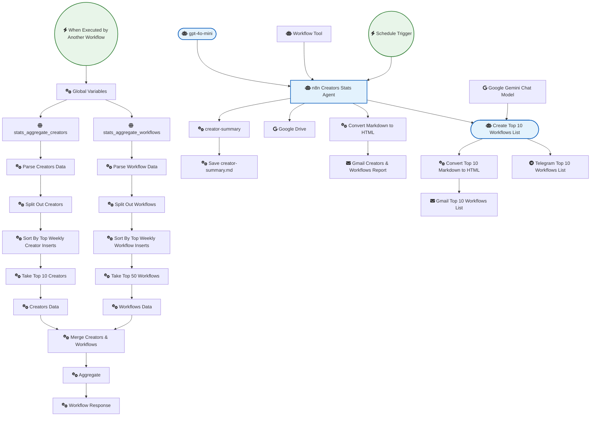

```mermaid
graph TD
    classDef trigger fill:#e8f5e9,stroke:#2e7d32,stroke-width:2px;
    classDef ai fill:#e3f2fd,stroke:#1565c0,stroke-width:2px;
    classDef logic fill:#fff3e0,stroke:#ef6c00,stroke-width:2px;

    stats_aggregate_creators["fas:fa-globe stats_aggregate_creators"]
    stats_aggregate_workflows["fas:fa-globe stats_aggregate_workflows"]
    Global_Variables["fas:fa-cogs Global Variables"]
    Parse_Workflow_Data["fas:fa-cogs Parse Workflow Data"]
    Parse_Creators_Data["fas:fa-cogs Parse Creators Data"]
    Aggregate["fas:fa-cogs Aggregate"]
    gpt_4o_mini(["fas:fa-robot gpt-4o-mini"]):::ai
    When_Executed_by_Another_Workflow(("fas:fa-bolt When Executed by Another Workflow")):::trigger
    Workflow_Tool["fas:fa-robot Workflow Tool"]
    creator_summary["fas:fa-cogs creator-summary"]
    Workflow_Response["fas:fa-cogs Workflow Response"]
    Save_creator_summary_md["fas:fa-cogs Save creator-summary.md"]
    Creators_Data["fas:fa-cogs Creators Data"]
    Workflows_Data["fas:fa-cogs Workflows Data"]
    Merge_Creators___Workflows["fas:fa-cogs Merge Creators & Workflows"]
    Split_Out_Creators["fas:fa-cogs Split Out Creators"]
    Split_Out_Workflows["fas:fa-cogs Split Out Workflows"]
    Sort_By_Top_Weekly_Creator_Inserts["fas:fa-cogs Sort By Top Weekly Creator Inserts"]
    Sort_By_Top_Weekly_Workflow_Inserts["fas:fa-cogs Sort By Top Weekly Workflow Inserts"]
    Schedule_Trigger(("fas:fa-bolt Schedule Trigger")):::trigger
    Take_Top_10_Creators["fas:fa-cogs Take Top 10 Creators"]
    Take_Top_50_Workflows["fas:fa-cogs Take Top 50 Workflows"]
    Google_Drive["fab:fa-google Google Drive"]
    Convert_Markdown_to_HTML["fas:fa-cogs Convert Markdown to HTML"]
    n8n_Creators_Stats_Agent["fas:fa-robot n8n Creators Stats Agent"]:::ai
    Google_Gemini_Chat_Model["fab:fa-google Google Gemini Chat Model"]
    Create_Top_10_Workflows_List(["fas:fa-robot Create Top 10 Workflows List"]):::ai
    Convert_Top_10_Markdown_to_HTML["fas:fa-cogs Convert Top 10 Markdown to HTML"]
    Gmail_Creators___Workflows_Report["fas:fa-envelope Gmail Creators & Workflows Report"]
    Telegram_Top_10_Workflows_List["fab:fa-telegram Telegram Top 10 Workflows List"]
    Gmail_Top_10_Workflows_List["fas:fa-envelope Gmail Top 10 Workflows List"]

    Aggregate --> Workflow_Response
    gpt_4o_mini --> n8n_Creators_Stats_Agent
    Creators_Data --> Merge_Creators___Workflows
    Workflow_Tool --> n8n_Creators_Stats_Agent
    Workflows_Data --> Merge_Creators___Workflows
    creator_summary --> Save_creator_summary_md
    Global_Variables --> stats_aggregate_creators
    Global_Variables --> stats_aggregate_workflows
    Schedule_Trigger --> n8n_Creators_Stats_Agent
    Split_Out_Creators --> Sort_By_Top_Weekly_Creator_Inserts
    Parse_Creators_Data --> Split_Out_Creators
    Parse_Workflow_Data --> Split_Out_Workflows
    Split_Out_Workflows --> Sort_By_Top_Weekly_Workflow_Inserts
    Take_Top_10_Creators --> Creators_Data
    Take_Top_50_Workflows --> Workflows_Data
    Convert_Markdown_to_HTML --> Gmail_Creators___Workflows_Report
    Google_Gemini_Chat_Model --> Create_Top_10_Workflows_List
    n8n_Creators_Stats_Agent --> creator_summary
    n8n_Creators_Stats_Agent --> Google_Drive
    n8n_Creators_Stats_Agent --> Convert_Markdown_to_HTML
    n8n_Creators_Stats_Agent --> Create_Top_10_Workflows_List
    stats_aggregate_creators --> Parse_Creators_Data
    stats_aggregate_workflows --> Parse_Workflow_Data
    Merge_Creators___Workflows --> Aggregate
    Create_Top_10_Workflows_List --> Convert_Top_10_Markdown_to_HTML
    Create_Top_10_Workflows_List --> Telegram_Top_10_Workflows_List
    Convert_Top_10_Markdown_to_HTML --> Gmail_Top_10_Workflows_List
    When_Executed_by_Another_Workflow --> Global_Variables
    Sort_By_Top_Weekly_Creator_Inserts --> Take_Top_10_Creators
    Sort_By_Top_Weekly_Workflow_Inserts --> Take_Top_50_Workflows
```
