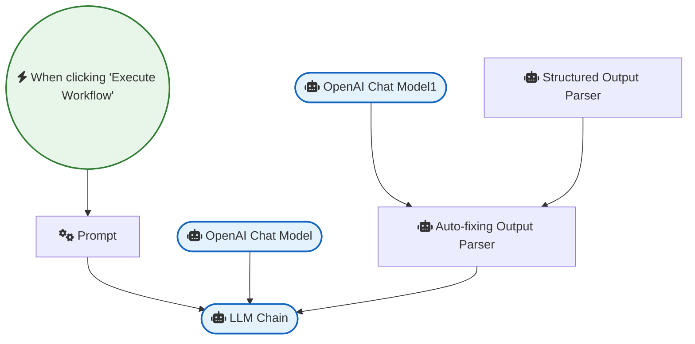

```mermaid
graph TD
    classDef trigger fill:#e8f5e9,stroke:#2e7d32,stroke-width:2px;
    classDef ai fill:#e3f2fd,stroke:#1565c0,stroke-width:2px;
    classDef logic fill:#fff3e0,stroke:#ef6c00,stroke-width:2px;

    When_clicking__Execute_Workflow_(("fas:fa-bolt When clicking 'Execute Workflow'")):::trigger
    Prompt["fas:fa-cogs Prompt"]
    LLM_Chain(["fas:fa-robot LLM Chain"]):::ai
    Structured_Output_Parser["fas:fa-robot Structured Output Parser"]
    Auto_fixing_Output_Parser["fas:fa-robot Auto-fixing Output Parser"]
    OpenAI_Chat_Model(["fas:fa-robot OpenAI Chat Model"]):::ai
    OpenAI_Chat_Model1(["fas:fa-robot OpenAI Chat Model1"]):::ai

    Prompt --> LLM_Chain
    OpenAI_Chat_Model --> LLM_Chain
    OpenAI_Chat_Model1 --> Auto_fixing_Output_Parser
    Structured_Output_Parser --> Auto_fixing_Output_Parser
    Auto_fixing_Output_Parser --> LLM_Chain
    When_clicking__Execute_Workflow_ --> Prompt
```
