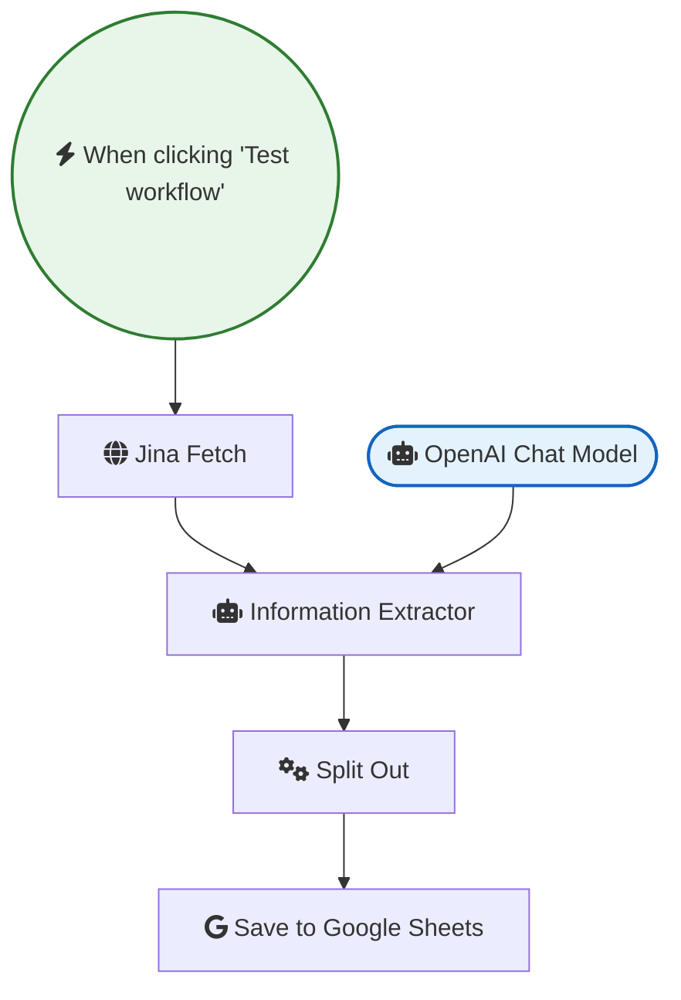

```mermaid
graph TD
    classDef trigger fill:#e8f5e9,stroke:#2e7d32,stroke-width:2px;
    classDef ai fill:#e3f2fd,stroke:#1565c0,stroke-width:2px;
    classDef logic fill:#fff3e0,stroke:#ef6c00,stroke-width:2px;

    When_clicking__Test_workflow_(("fas:fa-bolt When clicking 'Test workflow'")):::trigger
    Split_Out["fas:fa-cogs Split Out"]
    Save_to_Google_Sheets["fab:fa-google Save to Google Sheets"]
    OpenAI_Chat_Model(["fas:fa-robot OpenAI Chat Model"]):::ai
    Information_Extractor["fas:fa-robot Information Extractor"]
    Jina_Fetch["fas:fa-globe Jina Fetch"]

    Split_Out --> Save_to_Google_Sheets
    Jina_Fetch --> Information_Extractor
    OpenAI_Chat_Model --> Information_Extractor
    Information_Extractor --> Split_Out
    When_clicking__Test_workflow_ --> Jina_Fetch
```
