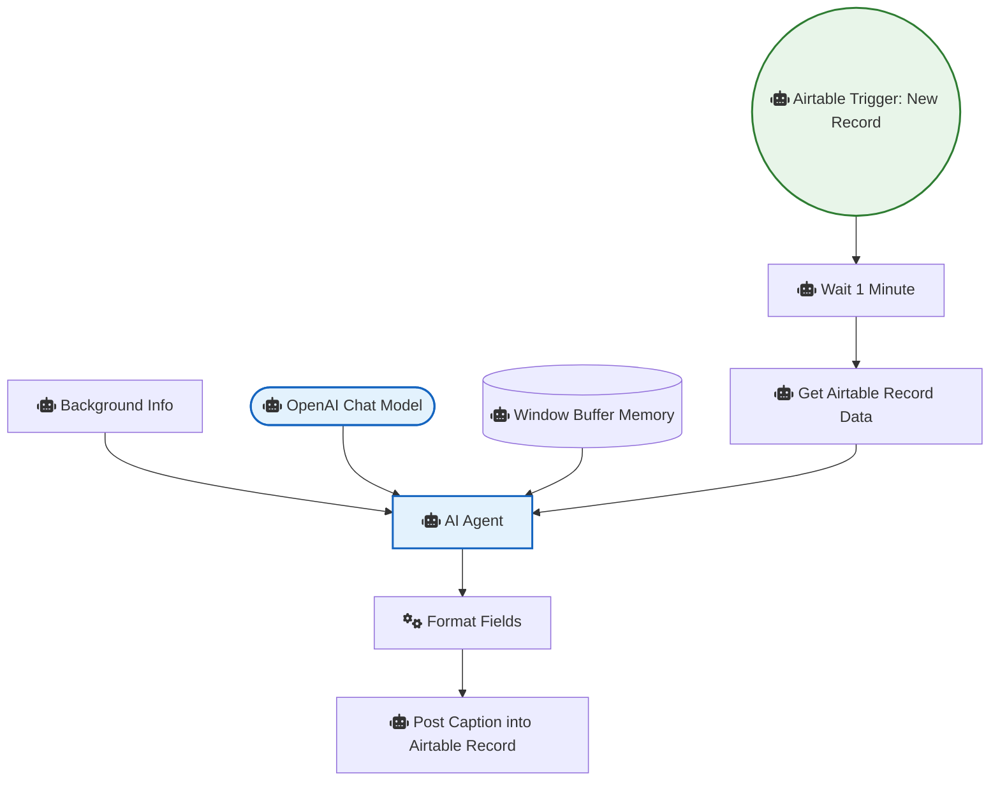

```mermaid
graph TD
    classDef trigger fill:#e8f5e9,stroke:#2e7d32,stroke-width:2px;
    classDef ai fill:#e3f2fd,stroke:#1565c0,stroke-width:2px;
    classDef logic fill:#fff3e0,stroke:#ef6c00,stroke-width:2px;

    AI_Agent["fas:fa-robot AI Agent"]:::ai
    OpenAI_Chat_Model(["fas:fa-robot OpenAI Chat Model"]):::ai
    Window_Buffer_Memory[("fas:fa-robot Window Buffer Memory")]
    Get_Airtable_Record_Data["fas:fa-robot Get Airtable Record Data"]
    Wait_1_Minute["fas:fa-robot Wait 1 Minute"]
    Format_Fields["fas:fa-cogs Format Fields"]
    Post_Caption_into_Airtable_Record["fas:fa-robot Post Caption into Airtable Record"]
    Airtable_Trigger__New_Record(("fas:fa-robot Airtable Trigger: New Record")):::trigger
    Background_Info["fas:fa-robot Background Info"]

    AI_Agent --> Format_Fields
    Format_Fields --> Post_Caption_into_Airtable_Record
    Wait_1_Minute --> Get_Airtable_Record_Data
    Background_Info --> AI_Agent
    OpenAI_Chat_Model --> AI_Agent
    Window_Buffer_Memory --> AI_Agent
    Get_Airtable_Record_Data --> AI_Agent
    Airtable_Trigger__New_Record --> Wait_1_Minute
```
