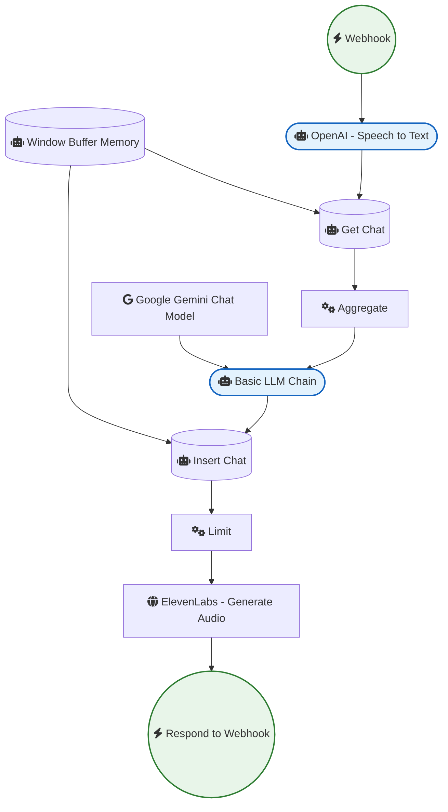

```mermaid
graph TD
    classDef trigger fill:#e8f5e9,stroke:#2e7d32,stroke-width:2px;
    classDef ai fill:#e3f2fd,stroke:#1565c0,stroke-width:2px;
    classDef logic fill:#fff3e0,stroke:#ef6c00,stroke-width:2px;

    Get_Chat[("fas:fa-robot Get Chat")]
    Insert_Chat[("fas:fa-robot Insert Chat")]
    Aggregate["fas:fa-cogs Aggregate"]
    Window_Buffer_Memory[("fas:fa-robot Window Buffer Memory")]
    Google_Gemini_Chat_Model["fab:fa-google Google Gemini Chat Model"]
    Respond_to_Webhook(("fas:fa-bolt Respond to Webhook")):::trigger
    ElevenLabs___Generate_Audio["fas:fa-globe ElevenLabs - Generate Audio"]
    Limit["fas:fa-cogs Limit"]
    Basic_LLM_Chain(["fas:fa-robot Basic LLM Chain"]):::ai
    Webhook(("fas:fa-bolt Webhook")):::trigger
    OpenAI___Speech_to_Text(["fas:fa-robot OpenAI - Speech to Text"]):::ai

    Limit --> ElevenLabs___Generate_Audio
    Webhook --> OpenAI___Speech_to_Text
    Get_Chat --> Aggregate
    Aggregate --> Basic_LLM_Chain
    Insert_Chat --> Limit
    Basic_LLM_Chain --> Insert_Chat
    Window_Buffer_Memory --> Insert_Chat
    Window_Buffer_Memory --> Get_Chat
    OpenAI___Speech_to_Text --> Get_Chat
    Google_Gemini_Chat_Model --> Basic_LLM_Chain
    ElevenLabs___Generate_Audio --> Respond_to_Webhook
```
