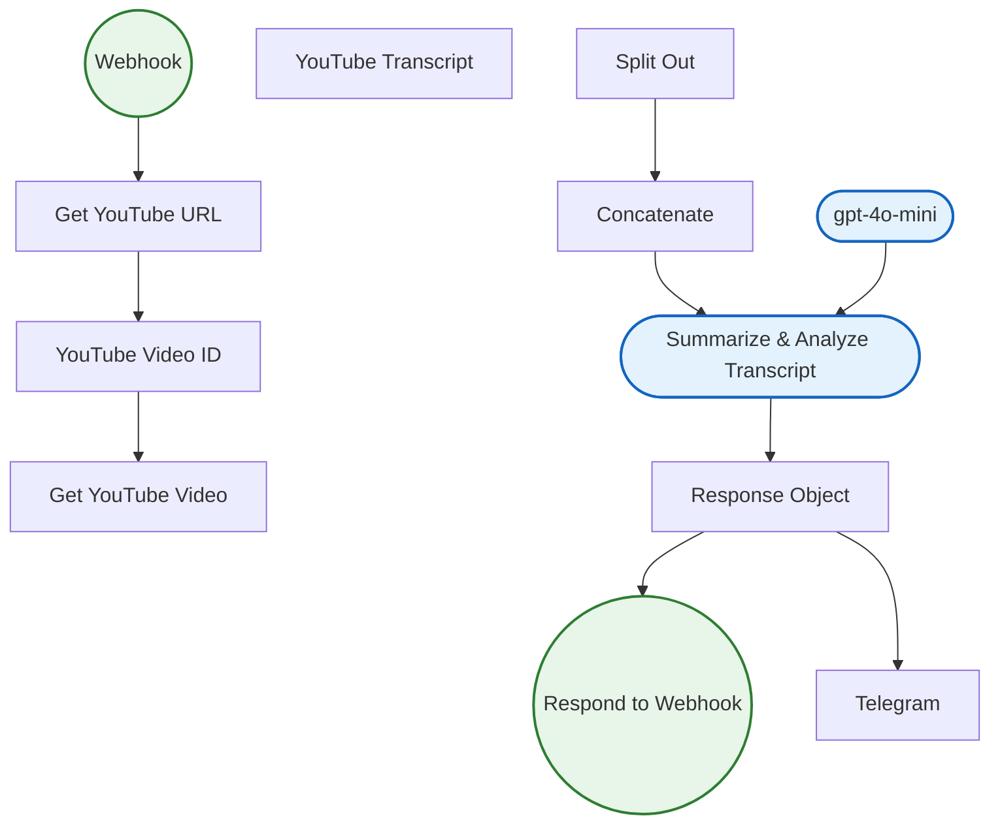

```mermaid
graph TD
    classDef trigger fill:#e8f5e9,stroke:#2e7d32,stroke-width:2px;
    classDef ai fill:#e3f2fd,stroke:#1565c0,stroke-width:2px;
    classDef logic fill:#fff3e0,stroke:#ef6c00,stroke-width:2px;

    Webhook(("Webhook")):::trigger
    YouTube_Transcript["YouTube Transcript"]
    Split_Out["Split Out"]
    Respond_to_Webhook(("Respond to Webhook")):::trigger
    Telegram["Telegram"]
    Get_YouTube_URL["Get YouTube URL"]
    YouTube_Video_ID["YouTube Video ID"]
    Get_YouTube_Video["Get YouTube Video"]
    gpt_4o_mini(["gpt-4o-mini"]):::ai
    Summarize___Analyze_Transcript(["Summarize & Analyze Transcript"]):::ai
    Concatenate["Concatenate"]
    Response_Object["Response Object"]

    Webhook --> Get_YouTube_URL
    Split_Out --> Concatenate
    Concatenate --> Summarize___Analyze_Transcript
    gpt_4o_mini --> Summarize___Analyze_Transcript
    Get_YouTube_URL --> YouTube_Video_ID
    Response_Object --> Respond_to_Webhook
    Response_Object --> Telegram
    YouTube_Video_ID --> Get_YouTube_Video
    Summarize___Analyze_Transcript --> Response_Object
```
