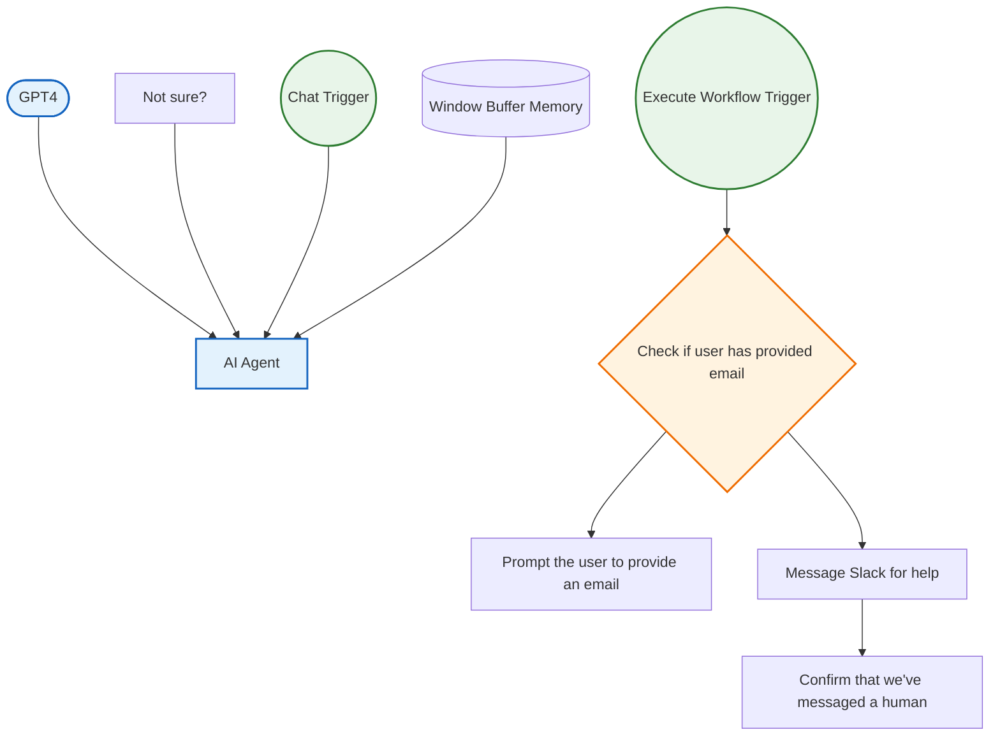

```mermaid
graph TD
    classDef trigger fill:#e8f5e9,stroke:#2e7d32,stroke-width:2px;
    classDef ai fill:#e3f2fd,stroke:#1565c0,stroke-width:2px;
    classDef logic fill:#fff3e0,stroke:#ef6c00,stroke-width:2px;

    Window_Buffer_Memory[("Window Buffer Memory")]
    Not_sure_["Not sure?"]
    Execute_Workflow_Trigger(("Execute Workflow Trigger")):::trigger
    Chat_Trigger(("Chat Trigger")):::trigger
    Prompt_the_user_to_provide_an_email["Prompt the user to provide an email"]
    Confirm_that_we_ve_messaged_a_human["Confirm that we've messaged a human"]
    AI_Agent["AI Agent"]:::ai
    Check_if_user_has_provided_email{"Check if user has provided email"}:::logic
    Message_Slack_for_help["Message Slack for help"]
    GPT4(["GPT4"]):::ai

    GPT4 --> AI_Agent
    Not_sure_ --> AI_Agent
    Chat_Trigger --> AI_Agent
    Window_Buffer_Memory --> AI_Agent
    Message_Slack_for_help --> Confirm_that_we_ve_messaged_a_human
    Execute_Workflow_Trigger --> Check_if_user_has_provided_email
    Check_if_user_has_provided_email --> Message_Slack_for_help
    Check_if_user_has_provided_email --> Prompt_the_user_to_provide_an_email
```
