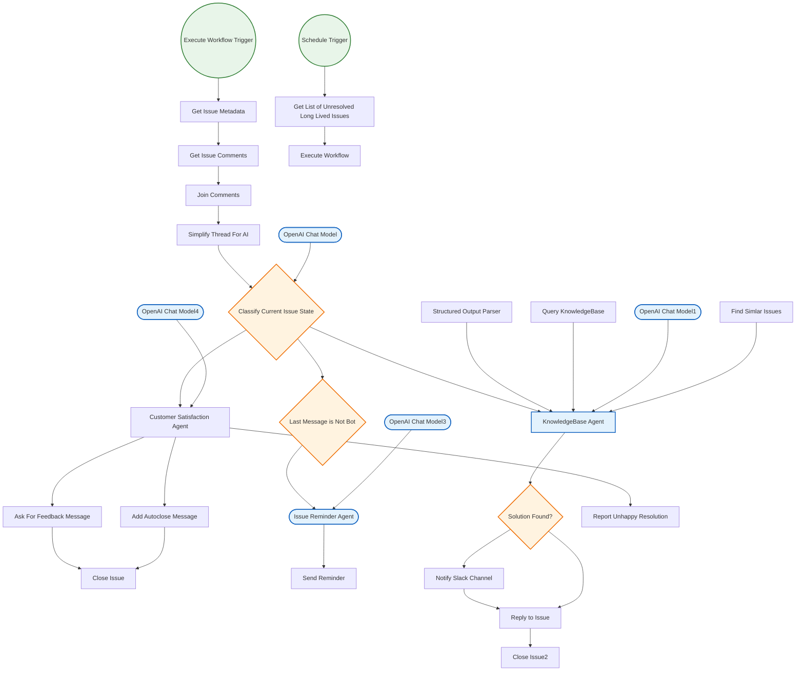

```mermaid
graph TD
    classDef trigger fill:#e8f5e9,stroke:#2e7d32,stroke-width:2px;
    classDef ai fill:#e3f2fd,stroke:#1565c0,stroke-width:2px;
    classDef logic fill:#fff3e0,stroke:#ef6c00,stroke-width:2px;

    OpenAI_Chat_Model(["OpenAI Chat Model"]):::ai
    OpenAI_Chat_Model1(["OpenAI Chat Model1"]):::ai
    OpenAI_Chat_Model3(["OpenAI Chat Model3"]):::ai
    OpenAI_Chat_Model4(["OpenAI Chat Model4"]):::ai
    Schedule_Trigger(("Schedule Trigger")):::trigger
    Get_Issue_Comments["Get Issue Comments"]
    Close_Issue["Close Issue"]
    Send_Reminder["Send Reminder"]
    Join_Comments["Join Comments"]
    Add_Autoclose_Message["Add Autoclose Message"]
    Ask_For_Feedback_Message["Ask For Feedback Message"]
    Simplify_Thread_For_AI["Simplify Thread For AI"]
    Solution_Found_{"Solution Found?"}:::logic
    Reply_to_Issue["Reply to Issue"]
    Last_Message_is_Not_Bot{"Last Message is Not Bot"}:::logic
    Structured_Output_Parser["Structured Output Parser"]
    Get_Issue_Metadata["Get Issue Metadata"]
    Notify_Slack_Channel["Notify Slack Channel"]
    Close_Issue2["Close Issue2"]
    Get_List_of_Unresolved_Long_Lived_Issues["Get List of Unresolved Long Lived Issues"]
    Execute_Workflow["Execute Workflow"]
    Execute_Workflow_Trigger(("Execute Workflow Trigger")):::trigger
    Customer_Satisfaction_Agent["Customer Satisfaction Agent"]
    KnowledgeBase_Agent["KnowledgeBase Agent"]:::ai
    Issue_Reminder_Agent(["Issue Reminder Agent"]):::ai
    Find_Simlar_Issues["Find Simlar Issues"]
    Query_KnowledgeBase["Query KnowledgeBase"]
    Report_Unhappy_Resolution["Report Unhappy Resolution"]
    Classify_Current_Issue_State{"Classify Current Issue State"}:::logic

    Join_Comments --> Simplify_Thread_For_AI
    Reply_to_Issue --> Close_Issue2
    Solution_Found_ --> Reply_to_Issue
    Solution_Found_ --> Notify_Slack_Channel
    Schedule_Trigger --> Get_List_of_Unresolved_Long_Lived_Issues
    OpenAI_Chat_Model --> Classify_Current_Issue_State
    Find_Simlar_Issues --> KnowledgeBase_Agent
    Get_Issue_Comments --> Join_Comments
    Get_Issue_Metadata --> Get_Issue_Comments
    OpenAI_Chat_Model1 --> KnowledgeBase_Agent
    OpenAI_Chat_Model3 --> Issue_Reminder_Agent
    OpenAI_Chat_Model4 --> Customer_Satisfaction_Agent
    KnowledgeBase_Agent --> Solution_Found_
    Query_KnowledgeBase --> KnowledgeBase_Agent
    Issue_Reminder_Agent --> Send_Reminder
    Notify_Slack_Channel --> Reply_to_Issue
    Add_Autoclose_Message --> Close_Issue
    Simplify_Thread_For_AI --> Classify_Current_Issue_State
    Last_Message_is_Not_Bot --> Issue_Reminder_Agent
    Ask_For_Feedback_Message --> Close_Issue
    Execute_Workflow_Trigger --> Get_Issue_Metadata
    Structured_Output_Parser --> KnowledgeBase_Agent
    Customer_Satisfaction_Agent --> Ask_For_Feedback_Message
    Customer_Satisfaction_Agent --> Add_Autoclose_Message
    Customer_Satisfaction_Agent --> Report_Unhappy_Resolution
    Classify_Current_Issue_State --> Customer_Satisfaction_Agent
    Classify_Current_Issue_State --> Last_Message_is_Not_Bot
    Classify_Current_Issue_State --> KnowledgeBase_Agent
    Get_List_of_Unresolved_Long_Lived_Issues --> Execute_Workflow
```
