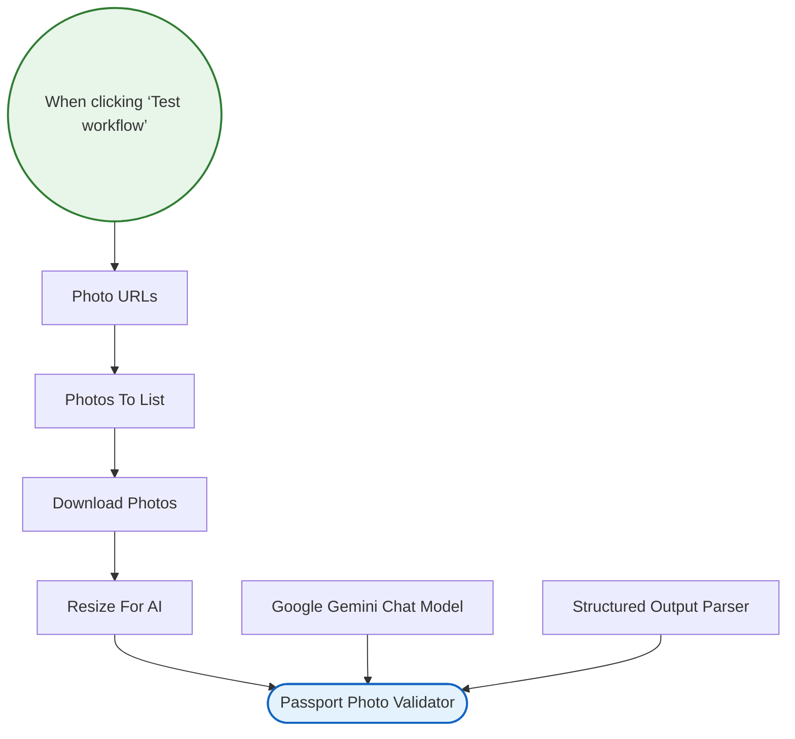

```mermaid
graph TD
    classDef trigger fill:#e8f5e9,stroke:#2e7d32,stroke-width:2px;
    classDef ai fill:#e3f2fd,stroke:#1565c0,stroke-width:2px;
    classDef logic fill:#fff3e0,stroke:#ef6c00,stroke-width:2px;

    When_clicking__Test_workflow_(("When clicking ‘Test workflow’")):::trigger
    Structured_Output_Parser["Structured Output Parser"]
    Photo_URLs["Photo URLs"]
    Photos_To_List["Photos To List"]
    Download_Photos["Download Photos"]
    Resize_For_AI["Resize For AI"]
    Passport_Photo_Validator(["Passport Photo Validator"]):::ai
    Google_Gemini_Chat_Model["Google Gemini Chat Model"]

    Photo_URLs --> Photos_To_List
    Resize_For_AI --> Passport_Photo_Validator
    Photos_To_List --> Download_Photos
    Download_Photos --> Resize_For_AI
    Google_Gemini_Chat_Model --> Passport_Photo_Validator
    Structured_Output_Parser --> Passport_Photo_Validator
    When_clicking__Test_workflow_ --> Photo_URLs
```
