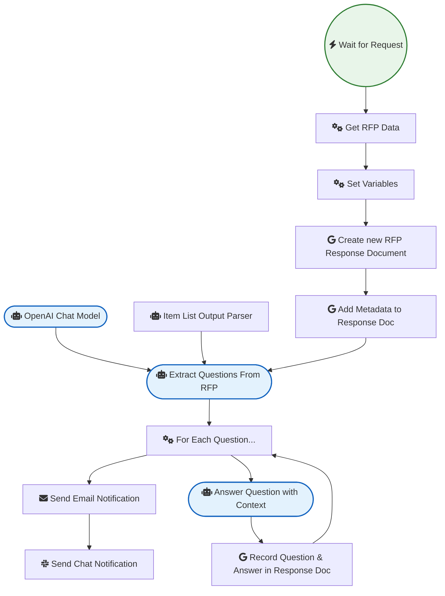

```mermaid
graph TD
    classDef trigger fill:#e8f5e9,stroke:#2e7d32,stroke-width:2px;
    classDef ai fill:#e3f2fd,stroke:#1565c0,stroke-width:2px;
    classDef logic fill:#fff3e0,stroke:#ef6c00,stroke-width:2px;

    Get_RFP_Data["fas:fa-cogs Get RFP Data"]
    Item_List_Output_Parser["fas:fa-robot Item List Output Parser"]
    For_Each_Question___["fas:fa-cogs For Each Question..."]
    Set_Variables["fas:fa-cogs Set Variables"]
    Create_new_RFP_Response_Document["fab:fa-google Create new RFP Response Document"]
    OpenAI_Chat_Model(["fas:fa-robot OpenAI Chat Model"]):::ai
    Send_Chat_Notification["fab:fa-slack Send Chat Notification"]
    Send_Email_Notification["fas:fa-envelope Send Email Notification"]
    Add_Metadata_to_Response_Doc["fab:fa-google Add Metadata to Response Doc"]
    Record_Question___Answer_in_Response_Doc["fab:fa-google Record Question & Answer in Response Doc"]
    Answer_Question_with_Context(["fas:fa-robot Answer Question with Context"]):::ai
    Wait_for_Request(("fas:fa-bolt Wait for Request")):::trigger
    Extract_Questions_From_RFP(["fas:fa-robot Extract Questions From RFP"]):::ai

    Get_RFP_Data --> Set_Variables
    Set_Variables --> Create_new_RFP_Response_Document
    Wait_for_Request --> Get_RFP_Data
    OpenAI_Chat_Model --> Extract_Questions_From_RFP
    For_Each_Question___ --> Send_Email_Notification
    For_Each_Question___ --> Answer_Question_with_Context
    Item_List_Output_Parser --> Extract_Questions_From_RFP
    Send_Email_Notification --> Send_Chat_Notification
    Extract_Questions_From_RFP --> For_Each_Question___
    Add_Metadata_to_Response_Doc --> Extract_Questions_From_RFP
    Answer_Question_with_Context --> Record_Question___Answer_in_Response_Doc
    Create_new_RFP_Response_Document --> Add_Metadata_to_Response_Doc
    Record_Question___Answer_in_Response_Doc --> For_Each_Question___
```
