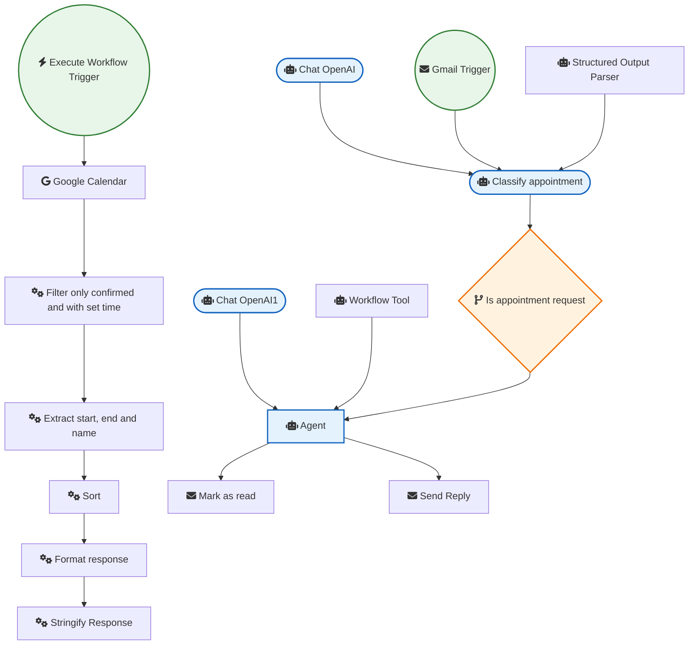

```mermaid
graph TD
    classDef trigger fill:#e8f5e9,stroke:#2e7d32,stroke-width:2px;
    classDef ai fill:#e3f2fd,stroke:#1565c0,stroke-width:2px;
    classDef logic fill:#fff3e0,stroke:#ef6c00,stroke-width:2px;

    Gmail_Trigger(("fas:fa-envelope Gmail Trigger")):::trigger
    Chat_OpenAI(["fas:fa-robot Chat OpenAI"]):::ai
    Workflow_Tool["fas:fa-robot Workflow Tool"]
    Chat_OpenAI1(["fas:fa-robot Chat OpenAI1"]):::ai
    Google_Calendar["fab:fa-google Google Calendar"]
    Execute_Workflow_Trigger(("fas:fa-bolt Execute Workflow Trigger")):::trigger
    Format_response["fas:fa-cogs Format response"]
    Stringify_Response["fas:fa-cogs Stringify Response"]
    Extract_start__end_and_name["fas:fa-cogs Extract start, end and name"]
    Filter_only_confirmed_and_with_set_time["fas:fa-cogs Filter only confirmed and with set time"]
    Is_appointment_request{"fas:fa-code-branch Is appointment request"}:::logic
    Classify_appointment(["fas:fa-robot Classify appointment"]):::ai
    Structured_Output_Parser["fas:fa-robot Structured Output Parser"]
    Sort["fas:fa-cogs Sort"]
    Mark_as_read["fas:fa-envelope Mark as read"]
    Send_Reply["fas:fa-envelope Send Reply"]
    Agent["fas:fa-robot Agent"]:::ai

    Sort --> Format_response
    Agent --> Send_Reply
    Agent --> Mark_as_read
    Chat_OpenAI --> Classify_appointment
    Chat_OpenAI1 --> Agent
    Gmail_Trigger --> Classify_appointment
    Workflow_Tool --> Agent
    Format_response --> Stringify_Response
    Google_Calendar --> Filter_only_confirmed_and_with_set_time
    Classify_appointment --> Is_appointment_request
    Is_appointment_request --> Agent
    Execute_Workflow_Trigger --> Google_Calendar
    Structured_Output_Parser --> Classify_appointment
    Extract_start__end_and_name --> Sort
    Filter_only_confirmed_and_with_set_time --> Extract_start__end_and_name
```
